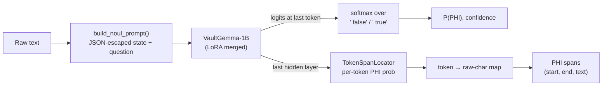

<div align="center">

# 🛡️ RedactX

**A calibrated, single-pass PHI / PII detector built on Google's VaultGemma-1B**

*One forward pass → a calibrated probability that text contains identifiers, plus the exact character spans to redact.*


</div>

> [!WARNING]
> **RedactX is experimental and not production-ready.** The first checkpoint (v1) was evaluated on held-out data
> and performed poorly (see [Benchmarks](#-benchmarks)). The training pipeline has been rebuilt (v2, contrastive
> recipe + trained span head). **v2 benchmark results will be published here once the training run completes.**
> Do not rely on RedactX as your only safeguard for regulated data.

---

## 📑 Contents

- [What RedactX does](#-what-redactx-does)
- [How it works](#-how-it-works)
- [Training data: the contrastive recipe](#-training-data-the-contrastive-recipe)
- [Quickstart](#-quickstart)
- [Using RedactX in Python](#-using-redactx-in-python)
- [REST API](#-rest-api)
- [Benchmarks](#-benchmarks)
- [Project layout](#-project-layout)
- [Limitations & honest notes](#-limitations--honest-notes)
- [Roadmap](#-roadmap)

---

## ✨ What RedactX does

| Capability | How |
|---|---|
| **Document gate** — "does this text contain PHI/PII?" | Reads the logits of ` true` / ` false` at the last prompt token: **one forward pass, no text generation**, so no hallucinated output. |
| **Calibrated probability** | Trained with KL + Brier + consistency losses; optional temperature scaling (`calibrate_temperature.py`). |
| **Span localization** — *which* characters to redact | A small token-classification head (`TokenSpanLocator`) on the last hidden layer, trained jointly with the gate. Spans are mapped back to exact raw-text offsets. |
| **Uncertainty-aware** | Normalized Shannon entropy per decision; optional Monte-Carlo "re-reads" when entropy is high. |
| **OpenJev-style decision API** | `noul` (binary), `choice` (categorical), `score` (ordinal) question types over one shared state, served at `POST /v1/decision`. |

---

## 🧠 How it works



**One prompt format everywhere.** Training and inference both build the prompt with
[`redactx/data/prompting.py`](redactx/data/prompting.py):

```text
[STATE]: {"raw_text": "<text, JSON-escaped>"}
[DECISION]: Contains HIPAA PHI or PII identifiers.
[VERDICT]:
```

JSON escaping shifts character offsets (quotes, newlines, non-ASCII). `build_noul_prompt` therefore also returns a
per-character map back to the raw text, which is used both to create span labels during training and to return
exact raw-text spans at inference.

**Training objective** (`redactx/training/openjev_trainer.py`):

$$
\mathcal{L} \;=\; \mathrm{KL}\!\left(p^{*}\,\|\,p_\theta\right) \;+\; \lambda_{B}\,\mathrm{Brier} \;+\; \lambda_{C}\,\mathcal{L}_{\text{consistency}} \;+\; \lambda_{S}\,\mathrm{BCE}_{\text{span}}
$$

- `KL`, `Brier` — over the `false`/`true` candidate tokens (soft targets 0.02 / 0.98).
- `consistency` — permutation consistency for `choice` records (inactive in the contrastive recipe, which is noul-only).
- `BCE_span` — masked token-level binary cross-entropy with a positive-class weight (`--span-pos-weight`); template tokens are ignored.

---

## 📚 Training data: the contrastive recipe

The v1 model learned a shortcut: every real-dataset sample was labelled PHI and the only "clean" examples were 12
fixed sentences, so it learned *"not one of those 12 sentences ⇒ PHI"*. The v2 recipe (`--recipe-contrastive`,
[`redactx/data/contrastive_corpus.py`](redactx/data/contrastive_corpus.py)) gives the model real contrast:

| Role | Source (Hugging Face) | What it teaches |
|---|---|---|
| **Positives** | `nvidia/Nemotron-PII` (native char spans), `gretelai/gretel-pii-masking-en-v1` (entities located in text) | What identifiers look like, with token-level span labels |
| **Contrastive negatives** | The *same* documents with every PII span replaced by a generic phrase (*"the person"*, *"a recent date"*, …) | The only difference is the identifiers — so the model must look at them, not at topic or style |
| **Natural negatives** | `qiaojin/PubMedQA` (pqa_artificial), `medalpaca/medical_meadow_medical_flashcards`, `iamtarun/python_code_instructions_18k_alpaca` | Varied clinical / scientific / code text is not PHI |
| **Held out (never trained on)** | `ai4privacy/pii-masking-openpii-1m`, PubMedQA `pqa_labeled` | Used only for evaluation |

For `--samples N` PII documents the corpus contains **N positives + N contrastive negatives + 0.5·N natural
negatives**. The train/validation split is done **per source document**, so a positive and its clean twin never
straddle the split.

---

## 🚀 Quickstart

### 1. Install

```powershell
git clone https://github.com/oyesanyf/RedactX.git
cd RedactX
python -m pip install -e .
python -m pip install presidio-analyzer && python -m spacy download en_core_web_lg   # optional: Presidio baseline in benchmarks
```

`google/vaultgemma-1b` is gated: accept its license on Hugging Face and provide a token. RedactX looks for
`--hf-token`, then `HF_TOKEN` in the environment, then the Hugging Face CLI login cache, then a local `.env`.

```powershell
$env:HF_TOKEN = "hf_..."      # current PowerShell session only
```

### 2. Train

> [!IMPORTANT]
> `train.py` **deletes `--output-dir` at the start of every run.** Use a new directory name to keep older checkpoints.

**Quick test run** (200 PII docs, 1 epoch — confirms everything works on your GPU):

```powershell
python train.py --model google/vaultgemma-1b --force-vaultgemma --device cuda `
  --recipe-contrastive --samples 200 --epochs 1 --batch-size 16 --lr 2e-4 --lambda-span 1.0 `
  --output-dir ./models/RedactX-v2-test --model-name RedactX
```

**Full run:**

```powershell
python train.py --model google/vaultgemma-1b --force-vaultgemma --device cuda `
  --recipe-contrastive --samples 2000 --epochs 3 --batch-size 16 --lr 2e-4 --lambda-span 1.0 `
  --output-dir ./models/RedactX-v2 --model-name RedactX
```

When training finishes, `train.py` frees the GPU and automatically runs the **held-out benchmark**, printing a
comparison table (this model vs. v1 vs. real Presidio) and saving `<output-dir>/validation_results.json`.

### 3. Re-run the benchmark any time

```powershell
python validate_model.py --model-dir ./models/RedactX-v2
```

### Key training flags

| Flag | Default | Meaning |
|---|---|---|
| `--recipe-contrastive` | off | Use the contrastive recipe (recommended) |
| `--samples` | 300 | Number of PII documents (contrastive) / synthetic records (legacy) |
| `--natural-negative-ratio` | 0.5 | Natural clean docs per PII doc |
| `--max-chars` / `--max-length` | 600 / 384 | Max characters of text per record / max prompt tokens |
| `--lambda-span` | 1.0 with contrastive, else 0 | Weight of the span-head loss (0 disables the span head) |
| `--span-pos-weight` | 3.0 | BCE weight on PII tokens |
| `--batch-size` / `--lr` / `--epochs` | 4 / 2e-4 / 3 | Effective batch, LoRA learning rate, epochs |
| `--no-benchmark` | off | Skip the post-training benchmark |
| `--benchmark-n-ai4privacy` | 200 | Held-out ai4privacy docs in the benchmark |
| `--benchmark-skip-presidio` | off | Don't run the Presidio baseline |
| `--no-merge` | off | Keep LoRA adapters unmerged (benchmark is skipped) |

### Training outputs

| File | Contents |
|---|---|
| `model.safetensors`, `config.json`, tokenizer files | Merged VaultGemma + LoRA weights |
| `redactx_span_locator.pt` | Trained span head (loaded automatically if present) |
| `scores.json` | In-distribution validation metrics per epoch (doc accuracy/recall/specificity, span P/R/F1, Brier, ECE) and corpus stats |
| `validation_results.json` | Held-out benchmark results |

---

## 🐍 Using RedactX in Python

### Simple: check one text

```python
from redactx import OpenJev

engine = OpenJev.from_pretrained("./models/RedactX-v2")

result = engine.evaluate_text("Pt. Raj Malhotra, DOB 3/14/1962, seen today for knee pain.")
print(result.verdict)            # "Contains_PHI_PII" or "Clean"
print(result.phi_probability)    # calibrated P(PHI)
for span in result.spans:        # from the trained span head only (empty if the checkpoint has none)
    print(span.start, span.end, span.text, span.category, span.confidence)
```

> [!NOTE]
> `span.category` is a lightweight heuristic label (DATE / IDENTIFIER / CONTACT / LOCATION / NAME). The span head
> itself predicts *PHI vs. not-PHI* per token; it does not classify entity types.

### Multi-question decisions

```python
from redactx import OpenJev, DecisionRequest, QuestionPayload

engine = OpenJev.from_pretrained("./models/RedactX-v2")
request = DecisionRequest(
    state="Patient Marcus Kowalski admitted on 04/12/2026 with acute chest pain.",
    questions=[
        QuestionPayload(key="has_phi", type="noul", question="Contains HIPAA PHI or PII identifiers."),
    ],
    samples=1,                 # >1 enables Monte-Carlo re-reads when entropy > entropy_threshold
    entropy_threshold=0.10,
)
response = engine.evaluate_decision(request)
print(response.answers["has_phi"], response.spans, response.latency_ms)
```

> [!TIP]
> The model is trained only on the `noul` question *"Contains HIPAA PHI or PII identifiers."* `choice` and `score`
> questions run through the same engine but are **not trained** in the contrastive recipe.

---

## 🌐 REST API

```powershell
redactx serve --port 8080
```

`POST /v1/decision` — request:

```json
{
  "state": "Patient Marcus Kowalski admitted on 04/12/2026 with acute chest pain.",
  "questions": [
    { "key": "has_phi", "type": "noul", "question": "Contains HIPAA PHI or PII identifiers." }
  ],
  "samples": 1,
  "entropy_threshold": 0.10
}
```

Response shape (field types, not measured values):

```text
{
  "model":      string,
  "latency_ms": float,
  "answers": {
    "has_phi": { "type": "noul", "probability": float, "confidence": float,
                 "value": bool, "re_reads_executed": int }
  },
  "spans": [ { "text": string, "start": int, "end": int, "category": string, "confidence": float } ]
}
```

---

## 📊 Benchmarks

All benchmark sets are **held out**: none of them is used by the contrastive training recipe.

| Set | Contents | Measures |
|---|---|---|
| **H** | 15 PHI + 15 clean handwritten sentences across domains (clinical, recipe, code, finance, science) | Doc-level discrimination on varied text |
| **G** | 200 generated clinical notes (140 PHI / 60 clean, seed 1337) with 812 gold spans | Doc metrics + span P/R/F1 |
| **P** | `ai4privacy/pii-masking-openpii-1m` *validation* split (English, real PII, gold spans) **plus** each doc's generic-replaced clean twin | Doc metrics on a real unseen distribution + span P/R/F1 |
| **Q** | PubMedQA `pqa_labeled` abstracts (clean) | Specificity on scientific text |

**Baseline:** real **Microsoft Presidio** (`presidio_analyzer` + spaCy `en_core_web_lg`), run live on the same
documents. Spans are scored with `BenchmarkSuite.evaluate_spans` (a prediction is an exact hit if it overlaps a gold
span with IoU ≥ 0.5 or a matching category).

### RedactX v2 (contrastive recipe + span head)

> [!NOTE]
> ⏳ **Pending.** Results will be added here after the full training run
> (`--samples 2000 --epochs 3`) and its automatic benchmark complete.

| Metric | RedactX v2 | Presidio |
|---|---|---|
| H — AUROC / specificity | *pending* | n/a |
| G — accuracy / specificity / AUROC | *pending* | n/a |
| G — span precision / recall / F1 | *pending* | *pending* |
| P — accuracy / specificity / AUROC | *pending* | n/a |
| P — span precision / recall / F1 | *pending* | *pending* |
| Q — specificity | *pending* | n/a |
| Latency (median / p95, `evaluate_text`) | *pending* | |

### RedactX v1 (60/20/20 recipe) — measured, superseded

Kept for transparency. These are the numbers that motivated the v2 rebuild.

| Set | Metric | RedactX v1 | Real Presidio |
|---|---|---|---|
| H | Clean sentences correctly passed | 0 / 15 | — |
| H | AUROC (PHI vs clean) | 0.562 | — |
| G | Accuracy (always-PHI baseline: 0.700) | 0.775 | — |
| G | Specificity / recall | 0.250 / 1.000 | — |
| G | AUROC / Brier / ECE | 0.902 / 0.199 / 0.177 | — |
| G | Span precision / recall / F1 | 0.784 / 0.206 / 0.326 ¹ | **0.863 / 0.760 / 0.808** |
| — | Forward-pass latency, median / p95 (Quadro RTX 4000) | 99 ms / 1601 ms | 127 ms/doc (CPU) |

¹ v1 had no trained span head; its span numbers come from the repository's earlier benchmark run.

---

## 🗂️ Project layout

```text
RedactX/
├── train.py                      # training entry point (+ automatic held-out benchmark)
├── validate_model.py             # held-out benchmark: H / G / P / Q sets vs. real Presidio
├── predict.py                    # quick CLI inference
├── calibrate_temperature.py      # temperature scaling on held-out data
├── redactx/
│   ├── data/
│   │   ├── prompting.py          # shared prompt builder + raw-offset map + span labels
│   │   ├── contrastive_corpus.py # v2 contrastive recipe
│   │   ├── openjev_dataset.py    # tokenized dataset + collation (span labels padded with -100)
│   │   ├── benchmark_loaders.py  # legacy recipes
│   │   └── generator.py          # synthetic clinical notes (used for benchmark set G)
│   ├── models/
│   │   ├── openjev.py            # inference engine (OpenJev / OpenJevVaultGemmaEngine)
│   │   └── span_locator.py       # TokenSpanLocator span head
│   ├── training/openjev_trainer.py
│   ├── evaluation/benchmark_suite.py
│   └── primitives.py             # request / response schemas
└── tests/                        # pytest suite (real tokenizers, no mocked outputs)
```

Run the tests:

```powershell
python -m pytest tests -q
```

---

## ⚖️ Limitations & honest notes

- **Differential privacy:** VaultGemma was *pre-trained* with differential privacy. RedactX fine-tuning uses standard
  (non-DP) optimization, so the DP guarantee does **not** extend to the fine-tuned weights.
- **English only** in training and evaluation.
- **Max length:** text is capped at `--max-chars` (600 by default) per decision; long documents must be chunked.
- **Span categories are heuristic** (see note above).
- **Training-time validation metrics are in-distribution.** Trust `validate_model.py` (held-out) over `scores.json`.
- **Dataset licenses:** check each dataset's license on Hugging Face before using trained weights commercially.
- **Model weights are not stored in this repository** (GitHub size limits); `/models/` is git-ignored.

---

## 🧭 Roadmap

- [x] Contrastive training recipe with real PII documents and clean twins
- [x] Jointly trained token span head with exact raw-offset mapping
- [x] Held-out benchmark against real Presidio, run automatically after training
- [ ] **Publish v2 benchmark results** (after full training run)
- [ ] Long-document chunking with span stitching
- [ ] Learned entity-type classification for spans
- [ ] Publish weights to Hugging Face with a model card containing only measured results
