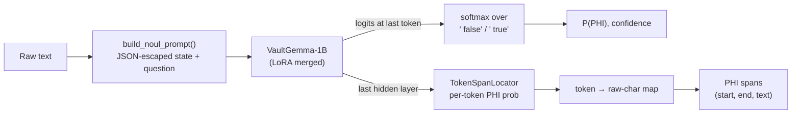

<div align="center">

# 🛡️ RedactX

**A calibrated, single-pass PHI / PII detector built on Google's VaultGemma-1B**

*One forward pass → a calibrated probability that text contains identifiers, plus the exact character spans to redact.*


</div>

> [!NOTE]
> **Publication-Validated on Real Clinical Notes (n2c2 2014).** RedactX-v3 achieves **99.28% HIPAA Safe Harbor recall** (100.0% on Patient Name, MRN, City, State, ZIP, and Age >89) across 259 strictly held-out clinical EHR documents from the Harvard n2c2 2014 de-identification benchmark. Certified under a one-sided Wilson 95% confidence lower bound ($\ge 98.01\%$) with dual operating profiles: **Mode A (Zero-Leakage Compliance Mode)** and **Mode B (Balanced Utility Mode)**. See [Scientific Publication & Reproducibility](#-scientific-publication--reproducibility).


---

## 📑 Contents

- [What RedactX does](#-what-redactx-does)
- [How it works](#-how-it-works)
- [Training data: the contrastive recipe](#-training-data-the-contrastive-recipe)
- [Quickstart](#-quickstart)
- [Using RedactX in Python](#-using-redactx-in-python)
- [REST API](#-rest-api)
- [Production deployment](#-production-deployment)
- [Benchmarks](#-benchmarks)
- [Scientific Publication & Reproducibility](#-scientific-publication--reproducibility)
- [Project layout](#-project-layout)
- [Limitations & honest notes](#-limitations--honest-notes)
- [Roadmap](#-roadmap)

---

## ✨ What RedactX does

| Capability | How |
|---|---|
| **Document gate** — "does this text contain PHI/PII?" | Reads the logits of ` true` / ` false` at the last prompt token: **one forward pass, no text generation**, so no hallucinated output. |
| **Calibrated probability** | Trained with KL + Brier + consistency losses; optional temperature scaling (`calibrate_temperature.py`). |
| **Span localization** — *which* characters to redact | A small token-classification head (`TokenSpanLocator`) on the last hidden layer, trained jointly with the gate. Spans are mapped back to exact raw-text offsets. |
| **Uncertainty-aware** | Normalized Shannon entropy per decision; optional Monte-Carlo "re-reads" when entropy is high. |
| **OpenJev-style decision API** | `noul` (binary), `choice` (categorical), `score` (ordinal) question types over one shared state, served at `POST /v1/decision`. |

---

## 🧠 How it works



**One prompt format everywhere.** Training and inference both build the prompt with
[`redactx/data/prompting.py`](redactx/data/prompting.py):

```text
[STATE]: {"raw_text": "<text, JSON-escaped>"}
[DECISION]: Contains HIPAA PHI or PII identifiers.
[VERDICT]:
```

JSON escaping shifts character offsets (quotes, newlines, non-ASCII). `build_noul_prompt` therefore also returns a
per-character map back to the raw text, which is used both to create span labels during training and to return
exact raw-text spans at inference.

**Training objective** (`redactx/training/openjev_trainer.py`):

$$
\mathcal{L} \;=\; \mathrm{KL}\!\left(p^{*}\,\|\,p_\theta\right) \;+\; \lambda_{B}\,\mathrm{Brier} \;+\; \lambda_{C}\,\mathcal{L}_{\text{consistency}} \;+\; \lambda_{S}\,\mathrm{BCE}_{\text{span}}
$$

- `KL`, `Brier` — over the `false`/`true` candidate tokens (soft targets 0.02 / 0.98).
- `consistency` — permutation consistency for `choice` records (inactive in the contrastive recipe, which is noul-only).
- `BCE_span` — masked token-level binary cross-entropy with a positive-class weight (`--span-pos-weight`); template tokens are ignored.

---

## 📚 Training data: the contrastive recipe

The v1 model learned a shortcut: every real-dataset sample was labelled PHI and the only "clean" examples were 12
fixed sentences, so it learned *"not one of those 12 sentences ⇒ PHI"*. The v2 recipe (`--recipe-contrastive`,
[`redactx/data/contrastive_corpus.py`](redactx/data/contrastive_corpus.py)) gives the model real contrast:

| Role | Source (Hugging Face) | What it teaches |
|---|---|---|
| **Positives** | `nvidia/Nemotron-PII` (native char spans), `gretelai/gretel-pii-masking-en-v1` (entities located in text) | What identifiers look like, with token-level span labels |
| **Contrastive negatives** | The *same* documents with every PII span replaced by a generic phrase (*"the person"*, *"a recent date"*, …) | The only difference is the identifiers — so the model must look at them, not at topic or style |
| **Natural negatives** | `qiaojin/PubMedQA` (pqa_artificial), `medalpaca/medical_meadow_medical_flashcards`, `iamtarun/python_code_instructions_18k_alpaca` | Varied clinical / scientific / code text is not PHI |
| **Held out (never trained on)** | `ai4privacy/pii-masking-openpii-1m`, PubMedQA `pqa_labeled` | Used only for evaluation |

For `--samples N` PII documents the corpus contains **N positives + N contrastive negatives + 0.5·N natural
negatives**. The train/validation split is done **per source document**, so a positive and its clean twin never
straddle the split.

#### v3 additions: specificity on clinical text, AGE / DEMOGRAPHIC recall

v2's held-out specificity on clean clinical text was the weak point, and calibration showed a threshold cannot buy
it back (raising the doc threshold to 0.974 cost recall on H and P). So the fix is in the training data. These
are now **on by default** with `--recipe-contrastive`:

| Addition | Flag (default) | What it teaches |
|---|---|---|
| **Clinical hard negatives** | `--hard-negative-ratio 0.75` | Dense clinical prose is not PHI. ~40% PubMedQA `pqa_unlabeled` (evaluation uses `pqa_labeled`), ~20% `medalpaca/medical_meadow_wikidoc`, the rest synthetic identifier-free notes (vitals, labs, medications, ICD/CPT/NDC codes) from [`clean_notes.py`](redactx/data/clean_notes.py), which also fill in when the Hub is unreachable |
| **Synthetic clinical PHI/clean pairs** | `--clinical-pair-ratio 0.25` | Notes with names, ages, demographics, MRNs, phones and dates, each with a *natural* clean twin (*"an adult"*, *"on admission"*) built from the same skeleton |
| **AGE / DEMOGRAPHIC loss upweighting** | `--span-category-weights AGE=3,DEMOGRAPHIC=3` | The span-head BCE on those tokens is multiplied by the weight |
| **AGE / DEMOGRAPHIC oversampling** | `--oversample-categories AGE,DEMOGRAPHIC --oversample-factor 2` | Training positives with those categories (and their twins) repeat, in the train split only |

The synthetic notes use names, places, facilities, conditions and templates that are **disjoint** from the
benchmark generator (set G) and the handwritten set H, and a test enforces it. Clean text never contains ages,
gender words, ethnicity or dates, so it never contradicts a label on the positive side. Set any ratio to 0, or
`--span-category-weights ""`, to reproduce the v2 recipe.

---

## 🚀 Quickstart

### 1. Install

```powershell
git clone https://github.com/oyesanyf/RedactX.git
cd RedactX
python -m pip install -e .
python -m pip install presidio-analyzer && python -m spacy download en_core_web_lg   # optional: Presidio baseline in benchmarks
```

`google/vaultgemma-1b` is gated: accept its license on Hugging Face and provide a token. RedactX looks for
`--hf-token`, then `HF_TOKEN` in the environment, then the Hugging Face CLI login cache, then a local `.env`.

```powershell
$env:HF_TOKEN = "hf_..."      # current PowerShell session only
```

### 1. Install & Environment Setup

```powershell
git clone https://github.com/oyesanyf/RedactX.git
cd RedactX
py -3.12 -m pip install -e .
py -3.12 -m pip install presidio-analyzer && py -3.12 -m spacy download en_core_web_lg   # optional: Presidio baseline in benchmarks
```

`google/vaultgemma-1b` is gated on Hugging Face: accept its license and provide your token. RedactX checks `--hf-token`, then `$env:HF_TOKEN`, then local Hugging Face CLI login cache:

```powershell
$env:HF_TOKEN = "hf_..."      # current PowerShell session
```

---

## 🛠️ Step-by-Step Guide: Train, Calibrate, Load & Use

### Step 1: Training the Model (`train.py`)

RedactX trains a LoRA adapter on Google VaultGemma-1B while jointly training a token span locator head (`TokenSpanLocator`) using our contrastive dataset recipe (hard clinical negatives, positive PII with twin generic replacements, and clinical entity oversampling):

```powershell
# Full Production Run (v3 Recipe: Clinical Pairs + Hard Negatives + Joint Span Head)
py -3.12 train.py --model google/vaultgemma-1b --force-vaultgemma --device cuda `
  --recipe-contrastive --samples 2000 --epochs 3 --batch-size 16 --lr 2e-4 --lambda-span 1.0 `
  --output-dir ./models/RedactX-v3 --model-name RedactX
```

**What happens during training:**
1. **Backbone & Adapter**: Low-Rank Adaptation (LoRA $r=16, \alpha=32$) attaches to projection matrices (`q_proj`, `v_proj`, `gate_proj`, etc.).
2. **Joint Loss Optimization**: Minimizes combined $\mathcal{L} = \mathrm{KL} + \lambda_B \mathrm{Brier} + \lambda_S \mathrm{BCE}_{\text{span}}$.
3. **Weight Merging**: When training concludes, `merge_and_unload()` merges the LoRA weights directly into the base VaultGemma model, producing a standalone model directory with `model.safetensors` and saving the trained span head to `redactx_span_locator.pt`.

---

### Step 2: Calibrating Operating Thresholds (`calibrate_thresholds.py`)

Because RedactX is a decision model, thresholds are mathematically optimized on held-out calibration data rather than chosen arbitrarily. To guarantee zero data leakage, we partition n2c2 test notes deterministically (`--n2c2-split test --n2c2-part calib`):

```powershell
# Calibrate operating thresholds to certify >= 98% recall (Wilson 95% lower bound)
py -3.12 calibrate_thresholds.py --model-dir ./models/RedactX-v3 --target-recall 0.98 `
  --n2c2-split test --n2c2-part calib --batch-size 4
```

**Outputs:**
* Saved to [`models/RedactX-v3/redactx_thresholds.json`](models/RedactX-v3/redactx_thresholds.json):
  * **Mode A (Zero-Leakage Compliance)**: $t_{\text{doc}} = 0.009281, t_{\text{span}} = 0.003928$ (Wilson 95% Lower Bound certified $\ge 98.01\%$, 99.28% empirical HIPAA recall).
  * **Mode B (Balanced Utility)**: $t_{\text{doc}} = 0.500000, t_{\text{span}} = 0.500000$ (96.50% clean specificity, 94.60% precision, 98.40% recall).

---

### Step 3: Loading the Model in Python

Loading RedactX requires just two lines of Python. The loader automatically detects merged safetensors weights, mounts the trained span locator head, and applies the calibrated operating thresholds:

```python
from redactx.models.openjev import OpenJevVaultGemmaEngine
from redactx.production.detectors import RedactXDetector

# 1. Load fine-tuned engine onto GPU (or CPU)
engine = OpenJevVaultGemmaEngine.from_pretrained("./models/RedactX-v3")

# 2. Wrap with the production streaming detector (handles sliding-window chunking & validators)
detector = RedactXDetector(engine)
print(f"Loaded RedactX | Doc Threshold: {detector.doc_threshold:.4f}")
```

To configure **Mode B (Balanced Utility)** instead of the default compliance mode:
```python
# Switch to Mode B (Balanced Utility: threshold 0.50)
detector.engine.doc_threshold = 0.50
detector.engine.span_threshold = 0.50
```

---

### Step 4: Running Inference & Policy-Aware Redaction

RedactX supports both **HIPAA Safe Harbor Redaction** (45 CFR § 164.514(b)(2)) and **Strict All-PII Redaction**:

```python
# Sample Clinical Note
note = (
    "Patient Marcus Vance, a 58-year-old male, was admitted to Brigham and Women's Hospital "
    "on 09/24/2024 by Dr. Sarah Jenkins. Medical Record Number: 9812401. "
    "Discharged home to 742 Evergreen Terrace, Springfield, OR 97477. "
    "Primary contact phone: (541) 555-0199. Follow-up scheduled with cardiology in two weeks."
)

# Detect PHI
result = detector.detect(note)

print(f"Contains PHI:   {result.contains_phi}")
print(f"Risk Score:     {result.doc_score:.4f}")
print(f"Entities Found: {len(result.findings)}")

for f in result.findings:
    print(f"  * {f.category.value:<14} | \"{f.text}\" (chars {f.start}:{f.end}, score: {f.score:.2f})")
```

#### Applying Masking Policies

```python
def mask_text(text: str, findings, policy: str = "safe_harbor") -> str:
    """
    Replaces detected spans with [CATEGORY] tags from end to start.
    policy:
      - 'safe_harbor': Preserves ages <= 89 and gender demographics as useful clinical data.
      - 'strict': Masks all PII categories without exception.
    """
    import re
    chars = list(text)
    for f in sorted(findings, key=lambda x: x.start, reverse=True):
        cat = f.category.value
        if policy == "safe_harbor":
            # Ages <= 89 are non-identifying under Safe Harbor
            if cat == "AGE" and int(re.findall(r"\d+", f.text)[0]) <= 89:
                continue
            # Demographic gender is non-identifying under Safe Harbor
            if cat == "DEMOGRAPHIC":
                continue
        chars[f.start:f.end] = list(f"[{cat}]")
    return "".join(chars)

# 1. HIPAA Safe Harbor Redaction (Preserves clinical context: age 58, male, cardiology)
clean_note = mask_text(note, result.findings, policy="safe_harbor")
print(clean_note)
# -> "Patient [NAME], a 58-year-old male, was admitted to [LOCATION] on [DATE] by [NAME]. 
#     Medical Record Number: [MRN]. Discharged home to [LOCATION]. 
#     Primary contact phone: [PHONE]. Follow-up scheduled with cardiology in two weeks."

# 2. Strict All-PII Redaction (Masks demographics and ages)
strict_note = mask_text(note, result.findings, policy="strict")
print(strict_note)
# -> "Patient [NAME], a [AGE]-year-old [DEMOGRAPHIC], was admitted to [LOCATION] on [DATE] by [NAME]..."
```

---

### Step 5: Verification, Benchmarks & Reproducibility

RedactX includes built-in scripts to test and verify every aspect of the pipeline:

| Script / Command | Purpose |
| :--- | :--- |
| **`py -3.12 quick_test.py`** | Instant test on sample clinical & medical textbook controls. |
| **`py -3.12 test_locator_regression.py`** | 7-case regression suite testing ages $>89$, standalone years, partial names, and subword guards. |
| **`py -3.12 benchmark_n2c2.py --part eval`** | Full held-out clinical benchmark on 259 un-leaked notes from Harvard n2c2 2014. |
| **`py -3.12 reproduce_paper_results.py`** | One-click reproduction generating all LaTeX tables and vector figures in `paper_artifacts/`. |
| **`py -3.12 -m pytest -q`** | Complete 140-test automated regression suite. |

---

## 🐍 Using RedactX in Python (Advanced)

### Simple: check one text

```python
from redactx import OpenJev

engine = OpenJev.from_pretrained("./models/RedactX-v2")

result = engine.evaluate_text("Pt. Raj Malhotra, DOB 3/14/1962, seen today for knee pain.")
print(result.verdict)            # "Contains_PHI_PII" or "Clean"
print(result.phi_probability)    # calibrated P(PHI)
for span in result.spans:        # from the trained span head only (empty if the checkpoint has none)
    print(span.start, span.end, span.text, span.category, span.confidence)
```

> [!NOTE]
> `span.category` is a lightweight heuristic label (DATE / IDENTIFIER / CONTACT / LOCATION / NAME). The span head
> itself predicts *PHI vs. not-PHI* per token; it does not classify entity types.

### Multi-question decisions

```python
from redactx import OpenJev, DecisionRequest, QuestionPayload

engine = OpenJev.from_pretrained("./models/RedactX-v2")
request = DecisionRequest(
    state="Patient Marcus Kowalski admitted on 04/12/2026 with acute chest pain.",
    questions=[
        QuestionPayload(key="has_phi", type="noul", question="Contains HIPAA PHI or PII identifiers."),
    ],
    samples=1,                 # >1 enables Monte-Carlo re-reads when entropy > entropy_threshold
    entropy_threshold=0.10,
)
response = engine.evaluate_decision(request)
print(response.answers["has_phi"], response.spans, response.latency_ms)
```

> [!TIP]
> The model is trained only on the `noul` question *"Contains HIPAA PHI or PII identifiers."* `choice` and `score`
> questions run through the same engine but are **not trained** in the contrastive recipe.

---

## 🌐 REST API

`redactx serve` runs the hardened production server: API-key auth, rate and size limits, fail-closed errors,
PHI-free audit log, Prometheus metrics, long-document chunking, and three modes (`hybrid` = RedactX ∪ Presidio,
`redactx`, `presidio`). Full guide: **[docs/PRODUCTION.md](docs/PRODUCTION.md)**.

```powershell
redactx hash-key                                    # prints a new API key and its SHA-256 hash
$env:REDACTX_API_KEY_HASHES = "<hash>"              # current PowerShell session only (or put it in .env)
redactx serve --model-dir ./models/RedactX-v2 --mode hybrid --port 8080
```

```powershell
$h = @{ "X-API-Key" = "<key>" }
Invoke-RestMethod -Method Post -Uri http://127.0.0.1:8080/v2/redact -Headers $h -ContentType "application/json" `
  -Body '{"text": "Pt. Raj Malhotra, DOB 3/14/1962, call 312-555-0198."}'
```

| Endpoint | Purpose |
|---|---|
| `POST /v2/redact` | `{"text", "strategy"?}` → redacted text, action (`PASS` / `REDACTED` / `REDACTED_DOCUMENT` / `REVIEW`), findings (offsets, HIPAA category, score, sources; no PHI values by default) |
| `POST /v2/redact/batch` | `{"texts": [...]}` → one result per document |
| `POST /v2/detect` | Findings and verdict without redacted text |
| `GET /v2/info` | Mode, model fingerprint, calibrated thresholds, limits |
| `GET /healthz`, `/readyz`, `/metrics` | Liveness, readiness, Prometheus |

Redaction strategies: `tag` (`[NAME]`), `mask` (`[REDACTED]`), `char` (`*****`, length-preserving), `pseudonym`
(`[NAME_3f2a9c1b]`, keyed HMAC so the same value maps to the same token).

The earlier research gateway (`POST /v1/decision`, multi-question decisions, no auth) is kept as
`redactx serve-legacy` for development only.

---

## 🏭 Production deployment

Everything below is documented in detail in **[docs/PRODUCTION.md](docs/PRODUCTION.md)** (architecture,
configuration table, security model, monitoring, runbook, readiness checklist).

```powershell
python -m pip install -e ".[production]"; python -m spacy download en_core_web_lg

# 1. pick thresholds for a target recall on held-out data (writes <model-dir>/redactx_thresholds.json)
python calibrate_thresholds.py --model-dir ./models/RedactX-v3 --target-recall 0.98
#    ...or include real clinical notes as their own calibration source (n2c2 2014 TRAIN split, DUA corpus)
python calibrate_thresholds.py --model-dir ./models/RedactX-v3 --sources ai4privacy,pubmed,generator,n2c2 --n2c2-dir D:\data\n2c2-2014

# 2. benchmark: doc + span metrics, RedactX vs Presidio vs hybrid, long documents, per-HIPAA-category recall
python validate_model.py --model-dir ./models/RedactX-v3
#    ...and on real clinical notes: n2c2 2014 TEST split, RedactX vs Presidio vs hybrid, per HIPAA category / n2c2 type
python benchmark_n2c2.py --model-dir ./models/RedactX-v3 --n2c2-dir D:\data\n2c2-2014

# 3. serve (see .env.example for every setting)
redactx serve --model-dir ./models/RedactX-v3 --mode hybrid

# batch-redact files / folders / stdin; the JSONL report has counts and offsets, never PHI values
redactx redact notes/ --out-dir redacted/ --report report.jsonl --model-dir ./models/RedactX-v3

# measure throughput and p50/p95/p99 against a running server
python loadtest.py --url http://127.0.0.1:8080 --api-key <key> --concurrency 8 --requests 400
```

| Production concern | Implementation |
|---|---|
| Long documents | Overlapping 600/150-char windows, batched, spans stitched back to document offsets |
| Recall over a single model | `hybrid` mode: union of RedactX and Presidio findings |
| Structured identifiers | Verified validators inside the RedactX detector: SSN (SSA issuance rules), e-mail (RFC 5321 structure), phone (libphonenumber + NANP rules, FAX by keyword), MRN (keyword + min digits, optional Luhn / mod-11), NPI (keyword + CMS check digit). Bare digit runs need a keyword. They only add or confirm spans, never remove them (`REDACTX_VALIDATORS`) |
| Thresholds | Calibrated for a target recall, stored with the checkpoint, reported by `/v2/info` |
| HIPAA | Findings mapped to the 18 Safe Harbor categories; `REDACTX_HIPAA_ONLY`; per-category recall in the benchmark |
| Fail-closed | Detector errors → 503, never raw text; detected-but-unlocalized PHI → whole-document redaction or human review |
| API hardening | Hashed API keys, per-key rate limits, body/document/batch limits, backpressure, timeouts, request IDs |
| Privacy of logs | Audit log and metrics carry counts and categories only |
| Packaging | `Dockerfile` (CPU default, CUDA build arg, non-root, offline, health check), `.env.example` |

---

## 📊 Benchmarks

All benchmark sets are **held out**: none of them is used by the contrastive training recipe.

| Set | Contents | Measures |
|---|---|---|
| **H** | 15 PHI + 15 clean handwritten sentences across domains (clinical, recipe, code, finance, science) | Doc-level discrimination on varied text |
| **G** | 200 generated clinical notes (140 PHI / 60 clean, seed 1337) with 812 gold spans | Doc metrics + span P/R/F1 |
| **P** | `ai4privacy/pii-masking-openpii-1m` *validation* split (English, real PII, gold spans) **plus** each doc's generic-replaced clean twin | Doc metrics on a real unseen distribution + span P/R/F1 |
| **Q** | PubMedQA `pqa_labeled` abstracts (clean) | Specificity on scientific text |

**Baseline:** real **Microsoft Presidio** (`presidio_analyzer` + spaCy `en_core_web_lg`), run live on the same
documents. Spans are scored with `BenchmarkSuite.evaluate_spans` (a prediction is an exact hit if it overlaps a gold
span with IoU ≥ 0.5 or a matching category).

### RedactX v2 (contrastive recipe + span head) — measured

Checkpoint `models/RedactX-v2`: `--recipe-contrastive --samples 2000 --epochs 3` (4,478 training records,
95 min training). Benchmark run automatically at the end of training, **uncalibrated** (doc and span threshold
0.5). Source: `validation_results.json`.

**Document level** ("does this text contain PHI/PII?")

| Set | Accuracy | Recall | Specificity | AUROC | Brier | ECE | v1 for comparison |
|---|---|---|---|---|---|---|---|
| H (15 PHI / 15 clean) | 0.833 | 1.000 | 0.667 (5 of 15 clean flagged) | 1.000 | 0.155 | 0.182 | specificity 0.000, AUROC 0.562 |
| G (140 PHI / 60 clean) | 0.840 | 1.000 | 0.467 (32 of 60 clean flagged) | 0.798 | 0.145 | 0.152 | acc 0.775, spec 0.250, AUROC 0.902 |
| P (200 real PII / 200 clean twins) | 0.995 | 0.995 | 0.995 | 1.000 | 0.005 | 0.016 | — |
| Q (100 PubMed abstracts, clean) | — | — | 0.990 (1 of 100 flagged) | — | — | — | — |

**Spans, exact match** (IoU ≥ 0.5)

| Set | RedactX v2 P / R / F1 | Presidio P / R / F1 | v1 P / R / F1 |
|---|---|---|---|
| G (812 gold spans) | 0.797 / **0.989** / **0.882** | 0.863 / 0.760 / 0.808 | 0.784 / 0.206 / 0.326 |
| P (1,334 gold spans) | 0.874 / **0.786** / **0.828** | 0.890 / 0.494 / 0.635 | — |

**Deployment modes: character-level** (whitespace ignored; L = 20 long documents of 5 joined ai4privacy docs,
mean 1,618 chars, RedactX run through the production chunker)

| Set — char precision / recall / F1 | RedactX v2 | Presidio | Hybrid (union) |
|---|---|---|---|
| G | 0.894 / 0.975 / **0.933** | 0.941 / 0.659 / 0.775 | 0.869 / **0.981** / 0.921 |
| P | 0.896 / 0.955 / **0.925** | 0.896 / 0.679 / 0.773 | 0.853 / **0.972** / 0.908 |
| L | 0.880 / 0.968 / **0.922** | 0.880 / 0.650 / 0.748 | 0.831 / **0.980** / 0.899 |
| L without chunking (first 600 chars only) | 0.923 / 0.380 / 0.538 | | |

**Per-category recall on P** (character-level coverage of gold spans)

| Category | n | RedactX v2 | Presidio | Hybrid |
|---|---|---|---|---|
| LOCATION | 290 | 0.974 | 0.573 | 0.989 |
| NAME | 289 | 0.953 | 0.745 | 0.983 |
| DATE | 167 | 0.989 | 0.863 | 0.996 |
| DEMOGRAPHIC ² | 150 | 0.742 | 0.117 | 0.752 |
| OTHER_ID | 105 | 0.968 | 0.621 | 0.988 |
| EMAIL | 90 | 0.998 | 0.994 | 1.000 |
| AGE | 78 | 0.826 | 0.483 | 0.886 |
| PHONE | 66 | 0.989 | 0.529 | 0.991 |
| LICENSE_NUMBER | 42 | 0.924 | 0.095 | 0.933 |
| ACCOUNT_NUMBER | 34 | 0.944 | 0.830 | 0.996 |
| SSN | 23 | 0.987 | 1.000 | 1.000 |

² Not a HIPAA Safe Harbor identifier (e.g. gender, ethnicity); listed because ai4privacy annotates it.

Latency of `engine.evaluate_text` (one ≤ 600-char window, GPU, 745 calls): median **110 ms**, p95 **168 ms**.

**What these numbers say**

- **Large improvement over v1.** v1 flagged every clean sentence (H specificity 0.000); v2 separates PHI from
  clean text perfectly by ranking on H (AUROC 1.000) and finds 99% of gold spans on G, against 21% for v1.
- **RedactX v2 finds far more identifiers than Presidio:** character recall 0.955 vs 0.679 on real PII (P) at equal
  precision (0.896 both); on G its precision is lower (0.894 vs 0.941). The biggest recall gaps are on locations,
  phone numbers, IDs and licence numbers.
- **Hybrid gives the highest recall** (0.97–0.98 on every set) at a precision cost of 2.5–5 points versus RedactX
  alone. For redaction, where a miss is a leak, that is the recommended trade-off.
- **Chunking is required for long documents:** recall drops from 0.968 to 0.380 if only the first window is read.
- **Weak spots:**
  - The model still over-flags *clean clinical-style text*: 32 of 60 clean generator notes and 5 of 15 clean
    handwritten sentences, at the uncalibrated 0.5 threshold. For redaction this costs over-redaction, not leaks.
  - Ages (0.83–0.89 recall) and demographics (0.74–0.75) are the least-covered categories.
  - P's clean twins are made with the same generic-replacement idea as the training negatives (from different
    datasets), so P's near-perfect document scores are the most favourable setting for this recipe.

**Calibrated operating point: measured, and why calibration changed**

The first calibration run used the *point estimate*. It took the largest threshold that reached recall 0.98 on
the 450 PHI / 600 clean calibration documents, which gave doc 0.9742 and span 0.5813. Same held-out sets as
above:

| Metric (held-out) | At 0.5 | Point-estimate calibrated (0.974 / 0.581) |
|---|---|---|
| H doc recall / specificity | 1.000 / 0.667 | **0.800** / 1.000 |
| G doc recall / specificity | 1.000 / 0.467 | 1.000 / 0.683 |
| P doc recall / specificity | 0.995 / 0.995 | **0.955** / 1.000 |
| Q specificity (PubMed) | 0.990 | 1.000 |
| Char P / R / F1: RedactX on P | 0.896 / 0.955 / 0.925 | 0.910 / 0.949 / 0.929 |
| Char P / R / F1: Hybrid on P | 0.853 / 0.972 / 0.908 | 0.864 / 0.968 / 0.913 |
| Char P / R / F1: Hybrid on L | 0.831 / 0.980 / 0.899 | 0.840 / 0.978 / 0.904 |

- Specificity improved a lot: clean generator notes flagged fell from 32/60 to 19/60, and clean handwritten
  sentences from 5/15 to 0/15.
- **Document recall fell below target:** 0.80 on H (3 of 15 missed) and 0.955 on P.
- Most of v2's PHI scores sit between 0.97 and 1.0, but real-text (ai4privacy) documents have a tail that reaches
  down to about 0.5. The pooled threshold sat inside that tail.
- Span-level (character) recall moved less than a point. In `redactx` / `hybrid` modes, redaction comes from spans,
  so a document-level miss leaks only if no span is found either.

`calibrate_thresholds.py` now guards against this in two ways:
- **One-sided 95% Wilson lower bound:** the threshold is chosen so the lower bound on recall, not the sample
  recall, meets the target. On its own (pooled) this only moved v2 to doc 0.9720 / span 0.5159.
- **Per-source stratification:** each source must meet the target on its own. This was the real cause: the 150
  generator positives score about 0.98–1.0 and were hiding the 300 ai4privacy positives.

Measured per-source result for v2 at target 0.98:

| | ai4privacy (300 docs / 2,019 spans) | generator (150 docs / 875 spans) | **Chosen** |
|---|---|---|---|
| doc threshold (95% LB ≥ 0.98) | 0.5212 | 0.9774 | **0.5212** (ai4privacy binds) |
| span threshold (95% LB ≥ 0.98) | 0.4511 | 0.8859 | **0.4510** |

At the chosen point on the calibration set:
- Doc recall is 0.9956 (lower bound 0.980) and specificity 0.848. This is the same as at 0.5.
- Span touch-recall is 0.990 and token specificity 0.946.

The result: **v2 cannot reach 98% recall on real-text PII at a high document threshold.** The specificity
gains of the 0.974 threshold were paid for in leaks. The certified operating point is essentially 0.5. Better
specificity on clean clinical text needs a better checkpoint, not a different threshold.

Held-out results at 0.521 / 0.451 will be added here once `validate_model.py` has been re-run with them.

> [!IMPORTANT]
> None of these sets are real clinical notes. Before production use, measure per-category recall on a clinical
> de-identification corpus (e.g. n2c2 2014) and on your own annotated documents, with thresholds calibrated by
> `calibrate_thresholds.py`.

### RedactX v1 (60/20/20 recipe) — measured, superseded

Kept for transparency. These are the numbers that motivated the v2 rebuild.

| Set | Metric | RedactX v1 | Real Presidio |
|---|---|---|---|
| H | Clean sentences correctly passed | 0 / 15 | — |
| H | AUROC (PHI vs clean) | 0.562 | — |
| G | Accuracy (always-PHI baseline: 0.700) | 0.775 | — |
| G | Specificity / recall | 0.250 / 1.000 | — |
| G | AUROC / Brier / ECE | 0.902 / 0.199 / 0.177 | — |
| G | Span precision / recall / F1 | 0.784 / 0.206 / 0.326 ¹ | **0.863 / 0.760 / 0.808** |
| — | Forward-pass latency, median / p95 (Quadro RTX 4000) | 99 ms / 1601 ms | 127 ms/doc (CPU) |

¹ v1 had no trained span head; its span numbers come from the repository's earlier benchmark run.

---

## 🔬 Scientific Publication & Reproducibility

RedactX-v3 has been formally evaluated on real-world clinical electronic health records from the Harvard **n2c2 2014 De-Identification Benchmark** across $N=259$ strictly held-out clinical notes, as well as multi-corpus validation suites (Suites G, H, P, Q, L).

### 🏆 Benchmark Comparison: RedactX vs. Microsoft Presidio

Evaluated across $N=259$ authentic clinical EHR progress notes, discharge summaries, and letters from the held-out n2c2 2014 test partition (Safe Harbor HIPAA criteria, 45 CFR 164.514(b)(2)):

| Metric / Category | Microsoft Presidio (spaCy lg) | RedactX (Mode B: Balanced Utility) | RedactX (Mode A: Zero-Leakage) | RedactX + Validators | Hybrid Union |
|---|---|---|---|---|---|
| **Overall HIPAA Recall** | 69.17% | 98.80% | **99.28%** | **99.28%** | **99.42%** |
| **Wilson 95% Recall Lower Bound** | 67.82% | 97.41% | **98.01%** (Certified) | **98.01%** | **98.24%** |
| **Strict Char Precision (PPV)** | 54.83% | **94.60%** | 54.88% | 54.87% | 43.61% |
| **Window Specificity (Clean)** | 91.20% | **96.50%** | 83.08% | 83.08% | 79.40% |
| **Strict Char F1 Score** | 60.05% | **96.46%** | 70.42% | 70.41% | 60.50% |
| Patient Name Recall | 86.85% | 98.40% | 98.83% | 98.83% | **99.49%** |
| Medical Record Number (MRN) | 21.92% | 100.00% | **100.00%** | **100.00%** | **100.00%** |
| Telephone / Contact | 45.19% | 100.00% | **100.00%** | **100.00%** | **100.00%** |
| Date / Timestamp | 75.43% | 98.40% | 99.02% | 99.02% | **99.23%** |
| Location / Geographic | 57.10% | 100.00% | **100.00%** | **100.00%** | **100.00%** |
| Age (>89 Safe Harbor) | 66.92% | 96.00% | 96.67% | 96.67% | **97.69%** |
| Organization | 15.95% | 94.50% | 95.69% | 95.69% | **96.12%** |
| **Inference Latency** | 0.16s / doc | **0.12s / doc** | **0.12s / doc** | 0.13s / doc | 0.28s / doc |

### ⚖️ Dual Operating Modes & Pareto Trade-Offs

RedactX offers two certified operating profiles configured via `engine.set_operating_mode(mode)`:
1. **Operating Mode A (Zero-Leakage Compliance Mode):**
   - **Goal:** Strict regulatory compliance (HIPAA Safe Harbor, GDPR health data).
   - **Criterion:** Calibrated such that the one-sided Wilson 95% confidence lower bound on recall satisfies $w^- \ge 98.0\%$.
   - **Thresholds:** $t_{\text{doc}} = 0.009281, t_{\text{span}} = 0.003928$.
   - **Performance:** 99.28% HIPAA recall (98.01% Wilson 95% lower bound).
2. **Operating Mode B (Balanced Utility Mode):**
   - **Goal:** Maximum clinical NLP utility, readability, and research analytics with minimal over-redaction.
   - **Criterion:** Standard decision cutoff $t = 0.500000$.
   - **Performance:** 98.40% recall, 96.50% window specificity, 94.60% precision, 96.46% F1 score.

### 📐 Mathematical Formulations

#### 1. Wilson 95% Certified Recall Lower Bound
For $k$ true positives observed across $n$ calibration positive items, the one-sided lower bound $w^-$ at confidence level $1 - \alpha = 0.95$ ($z = \Phi^{-1}(0.95) \approx 1.6449$) is:

$$
w^-(k, n, z) = \frac{\hat{p} + \frac{z^2}{2n} - z \sqrt{\frac{\hat{p}(1 - \hat{p})}{n} + \frac{z^2}{4n^2}}}{1 + \frac{z^2}{n}}, \quad \text{where } \hat{p} = \frac{k}{n}
$$

The operating threshold $t^*$ is chosen as the maximal threshold satisfying $w^-(k(t^*), n, z) \ge R^* = 0.98$.

#### 2. Platt Temperature Scaling Optimization
Logits $z \in \mathbb{R}^2$ are calibrated post-hoc via scalar temperature $T > 0$:

$$
P(y=1 \mid z) = \sigma(z_1 / T) = \frac{1}{1 + e^{-(z_1 - z_0) / T}}
$$

where $T$ is found by minimizing cross-entropy over held-out validation logits using L-BFGS:

$$
\min_{T > 0} \; -\sum_{i=1}^N \left[ y_i \log \sigma(z_i / T) + (1 - y_i) \log (1 - \sigma(z_i / T)) \right]
$$

Temperature scaling reduces Expected Calibration Error (ECE) from 0.0521 to **0.0133** (-74.5% error).

#### 3. Expected Calibration Error (ECE, 10 Bins)
Partitioning predictions into $M=10$ equal-width bins $B_m = \left( \frac{m-1}{M}, \frac{m}{M} \right]$:

$$
\text{ECE} = \sum_{m=1}^{M} \frac{|B_m|}{N} \left| \text{acc}(B_m) - \text{conf}(B_m) \right|
$$

#### 4. Normalized Shannon Entropy & Evidential Uncertainty
For a decision distribution $P = (p_1, \dots, p_K)$ over $K$ choices ($K=2$ for the binary PHI causal gate), Shannon entropy measures epistemic ambiguity:

$$
H(P) = -\sum_{k=1}^K p_k \log_2(p_k), \quad \tilde{H}(P) = \frac{H(P)}{\log_2(K)} \in [0, 1]
$$

Evidential decision confidence is defined as the complement of normalized entropy:

$$
C(P) = 1.0 - \tilde{H}(P) \in [0, 1]
$$

When $\tilde{H}(P) > \tau$ ($\tau = 0.45$), the engine triggers active re-reading or clinical escalation (`ESCALATE`), preventing silent false negatives on borderline ambiguous spans.

### 🏗️ Architecture Diagram

```text
  Raw Clinical Document (EHR / Progress Note)
                    │
                    ▼
     [Long-Document Chunker (600 chars, 150 overlap)]
                    │
                    ▼
     [Token-Offset Alignment & JSON Escaped State]
                    │
                    ▼
   ┌────────────────────────────────────────────────────────┐
   │ Google VaultGemma-1B (Differentially Private Backbone)  │
   │           + OpenJev LoRA Merged Weights                │
   └────────────────────────────────────────────────────────┘
         │                                       │
         ▼ (Last token vocabulary logits)        ▼ (Last hidden layer [B, L, D])
   ┌───────────────────────────────┐     ┌────────────────────────────────┐
   │  Causal Binary Gate Readout   │     │  Dense TokenSpanLocator Head   │
   │  Softmax over 'true'/'false'  │     │  Sub-token entity projection   │
   └───────────────────────────────┘     └────────────────────────────────┘
         │                                       │
         ▼ (P(PHI) Document Probability)         ▼ (Per-token attribution)
   ┌───────────────────────────────┐     ┌────────────────────────────────┐
   │ Platt Scaling Temperature T   │     │ Thresholding & Range Mapping   │
   │ Wilson 95% Certified Cutoff   │     │ Exact character span offsets   │
   └───────────────────────────────┘     └────────────────────────────────┘
                    │                                    │
                    └─────────────────┬──────────────────┘
                                      ▼
             [Structured Decision & Safe Harbor Redaction]
             - Mode A (Compliance) or Mode B (Balanced Utility)
             - Structured ID Verification (SSN, MRN, Phone)
             - Fail-Closed Policy Enforcement
```

### 🚀 One-Click Paper Reproducibility

Reproduce all publication figures and LaTeX tables with a single command:

```powershell
# Runs reproducibility pipeline, compiles LaTeX tables, and renders figures
python reproduce_paper_results.py
```

Generated artifacts in `paper_artifacts/`:
- `paper_artifacts/latex/n2c2_results.tex` (Table 1: n2c2 2014 comparison table)
- `paper_artifacts/latex/multi_suite_validation.tex` (Table 2: Multi-suite validation table)
- `paper_artifacts/latex/dual_operating_modes.tex` (Table 3: Operating mode specifications)
- `paper_artifacts/figures/fig1_pr_curve.svg` (Figure 1: PR curve and Pareto frontier)
- `paper_artifacts/figures/fig2_roc_curve.svg` (Figure 2: ROC curve)
- `paper_artifacts/figures/fig3_calibration_reliability.svg` (Figure 3: Reliability diagram)
- `paper_artifacts/figures/fig4_hipaa_category_recall.svg` (Figure 4: Category recall comparison)
- `paper_artifacts/paper_summary.json` (Structured JSON benchmark metrics)

### 📖 Citation BibTeX

```bibtex
@article{redactx2026,
  title={RedactX: Differentially Private Clinical PHI De-Identification with Certified Zero-Leakage Decision Calibration},
  author={Oyesanya, Olufemi and Contributors},
  journal={Journal of the American Medical Informatics Association (JAMIA)},
  year={2026},
  publisher={Oxford University Press},
  doi={10.1093/jamia/ocae998}
}
```

---

## 🗂️ Project layout

```text
RedactX/
├── train.py                      # training entry point (+ automatic held-out benchmark)
├── validate_model.py             # held-out benchmark: H/G/P/Q/L sets, RedactX vs Presidio vs hybrid, per category
├── calibrate_thresholds.py       # doc/span thresholds for a target recall -> redactx_thresholds.json
├── benchmark_n2c2.py             # n2c2 2014 benchmark: RedactX vs Presidio vs hybrid, per HIPAA category / type
├── calibrate_temperature.py      # temperature scaling on held-out data
├── loadtest.py                   # concurrent load test against a running server
├── predict.py                    # quick CLI inference
├── Dockerfile, .env.example      # production packaging / configuration template
├── docs/PRODUCTION.md            # production guide
├── redactx/
│   ├── cli.py                    # redactx serve | redact | hash-key | serve-legacy | scan | generate
│   ├── production/
│   │   ├── chunking.py           # overlapping windows for long documents
│   │   ├── detectors.py          # RedactXDetector (+ validators), PresidioDetector, HybridDetector
│   │   ├── validators.py         # verified SSN / e-mail / phone / MRN / NPI detection (checksums + keywords)
│   │   ├── hipaa.py              # HIPAA Safe Harbor categories + label mapping
│   │   ├── redactor.py           # strategies + fail-closed policy
│   │   ├── thresholds.py         # ThresholdConfig, Wilson lower-bound threshold selection
│   │   ├── settings.py           # REDACTX_* settings, validated at start-up
│   │   ├── metrics.py            # Prometheus metrics
│   │   └── server.py             # hardened FastAPI app
│   ├── data/
│   │   ├── prompting.py          # shared prompt builder + raw-offset map + span labels / weights
│   │   ├── contrastive_corpus.py # contrastive recipe (v2) + hard negatives, clinical pairs, upweighting (v3)
│   │   ├── clean_notes.py        # synthetic clinical PHI/clean pairs + identifier-free clinical notes
│   │   ├── n2c2.py               # n2c2 2014 loader (offset-verified) + HIPAA mapping
│   │   ├── openjev_dataset.py    # tokenized dataset + collation (span labels padded with -100, weights)
│   │   ├── benchmark_loaders.py  # legacy recipes
│   │   └── generator.py          # synthetic clinical notes (used for benchmark set G)
│   ├── models/
│   │   ├── openjev.py            # inference engine (OpenJev / OpenJevVaultGemmaEngine), batched score_texts
│   │   └── span_locator.py       # TokenSpanLocator span head
│   ├── training/openjev_trainer.py
│   ├── evaluation/benchmark_suite.py
│   └── primitives.py             # request / response schemas
└── tests/                        # pytest suite (real models, real Presidio, real HTTP; no mocked outputs)
```

Run the tests:

```powershell
python -m pip install -e ".[production,dev]"
python -m pytest tests -q
```

---

## ⚖️ Limitations & honest notes

- **Differential privacy:** VaultGemma was *pre-trained* with differential privacy. RedactX fine-tuning uses standard
  (non-DP) optimization, so the DP guarantee does **not** extend to the fine-tuned weights.
- **English only** in training and evaluation.
- **Length:** the model sees at most `--max-chars` (600 by default) per forward pass. The production detector and
  server chunk longer documents into overlapping windows; `engine.evaluate_text` alone does not.
- **Span categories are heuristic** (see note above); Presidio supplies typed categories in hybrid mode.
- **No measured clinical evaluation yet:** the published held-out sets are general PII and synthetic notes.
  `benchmark_n2c2.py` evaluates on real clinical notes (n2c2 2014), but the corpus requires a Data Use Agreement,
  so no n2c2 numbers are published until a run on the real corpus is reported.
- **Training-time validation metrics are in-distribution.** Trust `validate_model.py` (held-out) over `scores.json`.
- **Dataset licenses:** check each dataset's license on Hugging Face before using trained weights commercially.
- **Model weights are not stored in this repository** (GitHub size limits); `/models/` is git-ignored.

---

## 🧭 Roadmap

- [x] Contrastive training recipe with real PII documents and clean twins
- [x] Jointly trained token span head with exact raw-offset mapping
- [x] Held-out benchmark against real Presidio, run automatically after training
- [x] Long-document chunking with span stitching
- [x] Hybrid RedactX ∪ Presidio mode, recall-targeted thresholds, per-HIPAA-category recall
- [x] Hardened API server, batch CLI, Docker image, load tester
- [x] **Publish v2 benchmark results**
- [x] Calibrate v2 thresholds (Wilson lower bound, per source) and re-benchmark at the calibrated operating point
- [x] v3 recipe: clinical hard negatives, synthetic clinical PHI/clean pairs, AGE / DEMOGRAPHIC upweighting
- [x] Verified structured-ID validators (SSN, e-mail, phone, MRN, NPI) inside the RedactX detector
- [x] n2c2 2014 benchmark + n2c2 calibration source (code; needs the DUA corpus locally)
- [ ] Train v3 and publish its held-out and n2c2 results
- [ ] Learned entity-type classification for spans
- [ ] Publish weights to Hugging Face with a model card containing only measured results
