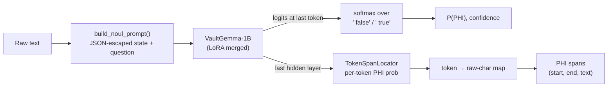

<div align="center">

# 🛡️ RedactX

**A calibrated, single-pass PHI / PII detector built on Google's VaultGemma-1B**

*One forward pass → a calibrated probability that text contains identifiers, plus the exact character spans to redact.*


</div>

> [!WARNING]
> **Not yet validated on real clinical notes.** RedactX v2 clearly beats both v1 and Presidio on the held-out
> general-PII and synthetic-note benchmarks (see [Benchmarks](#-benchmarks)), and the production service code is in
> place. It still over-flags some clean clinical-style text, and none of the benchmark sets are real clinical notes.
> Deploy in `hybrid` mode (RedactX ∪ Presidio), calibrate thresholds, and complete the
> [readiness checklist](docs/PRODUCTION.md#readiness-checklist) — including a clinical evaluation such as n2c2 2014 —
> before processing real PHI.

---

## 📑 Contents

- [What RedactX does](#-what-redactx-does)
- [How it works](#-how-it-works)
- [Training data: the contrastive recipe](#-training-data-the-contrastive-recipe)
- [Quickstart](#-quickstart)
- [Using RedactX in Python](#-using-redactx-in-python)
- [REST API](#-rest-api)
- [Production deployment](#-production-deployment)
- [Benchmarks](#-benchmarks)
- [Project layout](#-project-layout)
- [Limitations & honest notes](#-limitations--honest-notes)
- [Roadmap](#-roadmap)

---

## ✨ What RedactX does

| Capability | How |
|---|---|
| **Document gate** — "does this text contain PHI/PII?" | Reads the logits of ` true` / ` false` at the last prompt token: **one forward pass, no text generation**, so no hallucinated output. |
| **Calibrated probability** | Trained with KL + Brier + consistency losses; optional temperature scaling (`calibrate_temperature.py`). |
| **Span localization** — *which* characters to redact | A small token-classification head (`TokenSpanLocator`) on the last hidden layer, trained jointly with the gate. Spans are mapped back to exact raw-text offsets. |
| **Uncertainty-aware** | Normalized Shannon entropy per decision; optional Monte-Carlo "re-reads" when entropy is high. |
| **OpenJev-style decision API** | `noul` (binary), `choice` (categorical), `score` (ordinal) question types over one shared state, served at `POST /v1/decision`. |

---

## 🧠 How it works



**One prompt format everywhere.** Training and inference both build the prompt with
[`redactx/data/prompting.py`](redactx/data/prompting.py):

```text
[STATE]: {"raw_text": "<text, JSON-escaped>"}
[DECISION]: Contains HIPAA PHI or PII identifiers.
[VERDICT]:
```

JSON escaping shifts character offsets (quotes, newlines, non-ASCII). `build_noul_prompt` therefore also returns a
per-character map back to the raw text, which is used both to create span labels during training and to return
exact raw-text spans at inference.

**Training objective** (`redactx/training/openjev_trainer.py`):

$$
\mathcal{L} \;=\; \mathrm{KL}\!\left(p^{*}\,\|\,p_\theta\right) \;+\; \lambda_{B}\,\mathrm{Brier} \;+\; \lambda_{C}\,\mathcal{L}_{\text{consistency}} \;+\; \lambda_{S}\,\mathrm{BCE}_{\text{span}}
$$

- `KL`, `Brier` — over the `false`/`true` candidate tokens (soft targets 0.02 / 0.98).
- `consistency` — permutation consistency for `choice` records (inactive in the contrastive recipe, which is noul-only).
- `BCE_span` — masked token-level binary cross-entropy with a positive-class weight (`--span-pos-weight`); template tokens are ignored.

---

## 📚 Training data: the contrastive recipe

The v1 model learned a shortcut: every real-dataset sample was labelled PHI and the only "clean" examples were 12
fixed sentences, so it learned *"not one of those 12 sentences ⇒ PHI"*. The v2 recipe (`--recipe-contrastive`,
[`redactx/data/contrastive_corpus.py`](redactx/data/contrastive_corpus.py)) gives the model real contrast:

| Role | Source (Hugging Face) | What it teaches |
|---|---|---|
| **Positives** | `nvidia/Nemotron-PII` (native char spans), `gretelai/gretel-pii-masking-en-v1` (entities located in text) | What identifiers look like, with token-level span labels |
| **Contrastive negatives** | The *same* documents with every PII span replaced by a generic phrase (*"the person"*, *"a recent date"*, …) | The only difference is the identifiers — so the model must look at them, not at topic or style |
| **Natural negatives** | `qiaojin/PubMedQA` (pqa_artificial), `medalpaca/medical_meadow_medical_flashcards`, `iamtarun/python_code_instructions_18k_alpaca` | Varied clinical / scientific / code text is not PHI |
| **Held out (never trained on)** | `ai4privacy/pii-masking-openpii-1m`, PubMedQA `pqa_labeled` | Used only for evaluation |

For `--samples N` PII documents the corpus contains **N positives + N contrastive negatives + 0.5·N natural
negatives**. The train/validation split is done **per source document**, so a positive and its clean twin never
straddle the split.

---

## 🚀 Quickstart

### 1. Install

```powershell
git clone https://github.com/oyesanyf/RedactX.git
cd RedactX
python -m pip install -e .
python -m pip install presidio-analyzer && python -m spacy download en_core_web_lg   # optional: Presidio baseline in benchmarks
```

`google/vaultgemma-1b` is gated: accept its license on Hugging Face and provide a token. RedactX looks for
`--hf-token`, then `HF_TOKEN` in the environment, then the Hugging Face CLI login cache, then a local `.env`.

```powershell
$env:HF_TOKEN = "hf_..."      # current PowerShell session only
```

### 2. Train

> [!IMPORTANT]
> `train.py` **deletes `--output-dir` at the start of every run.** Use a new directory name to keep older checkpoints.

**Quick test run** (200 PII docs, 1 epoch — confirms everything works on your GPU):

```powershell
python train.py --model google/vaultgemma-1b --force-vaultgemma --device cuda `
  --recipe-contrastive --samples 200 --epochs 1 --batch-size 16 --lr 2e-4 --lambda-span 1.0 `
  --output-dir ./models/RedactX-v2-test --model-name RedactX
```

**Full run:**

```powershell
python train.py --model google/vaultgemma-1b --force-vaultgemma --device cuda `
  --recipe-contrastive --samples 2000 --epochs 3 --batch-size 16 --lr 2e-4 --lambda-span 1.0 `
  --output-dir ./models/RedactX-v2 --model-name RedactX
```

When training finishes, `train.py` frees the GPU and automatically runs the **held-out benchmark**, printing a
comparison table (this model vs. v1 vs. real Presidio) and saving `<output-dir>/validation_results.json`.

### 3. Re-run the benchmark any time

```powershell
python validate_model.py --model-dir ./models/RedactX-v2
```

### Key training flags

| Flag | Default | Meaning |
|---|---|---|
| `--recipe-contrastive` | off | Use the contrastive recipe (recommended) |
| `--samples` | 300 | Number of PII documents (contrastive) / synthetic records (legacy) |
| `--natural-negative-ratio` | 0.5 | Natural clean docs per PII doc |
| `--max-chars` / `--max-length` | 600 / 384 | Max characters of text per record / max prompt tokens |
| `--lambda-span` | 1.0 with contrastive, else 0 | Weight of the span-head loss (0 disables the span head) |
| `--span-pos-weight` | 3.0 | BCE weight on PII tokens |
| `--batch-size` / `--lr` / `--epochs` | 4 / 2e-4 / 3 | Effective batch, LoRA learning rate, epochs |
| `--no-benchmark` | off | Skip the post-training benchmark |
| `--benchmark-n-ai4privacy` | 200 | Held-out ai4privacy docs in the benchmark |
| `--benchmark-skip-presidio` | off | Don't run the Presidio baseline |
| `--no-merge` | off | Keep LoRA adapters unmerged (benchmark is skipped) |

### Training outputs

| File | Contents |
|---|---|
| `model.safetensors`, `config.json`, tokenizer files | Merged VaultGemma + LoRA weights |
| `redactx_span_locator.pt` | Trained span head (loaded automatically if present) |
| `scores.json` | In-distribution validation metrics per epoch (doc accuracy/recall/specificity, span P/R/F1, Brier, ECE) and corpus stats |
| `validation_results.json` | Held-out benchmark results |

---

## 🐍 Using RedactX in Python

### Simple: check one text

```python
from redactx import OpenJev

engine = OpenJev.from_pretrained("./models/RedactX-v2")

result = engine.evaluate_text("Pt. Raj Malhotra, DOB 3/14/1962, seen today for knee pain.")
print(result.verdict)            # "Contains_PHI_PII" or "Clean"
print(result.phi_probability)    # calibrated P(PHI)
for span in result.spans:        # from the trained span head only (empty if the checkpoint has none)
    print(span.start, span.end, span.text, span.category, span.confidence)
```

> [!NOTE]
> `span.category` is a lightweight heuristic label (DATE / IDENTIFIER / CONTACT / LOCATION / NAME). The span head
> itself predicts *PHI vs. not-PHI* per token; it does not classify entity types.

### Multi-question decisions

```python
from redactx import OpenJev, DecisionRequest, QuestionPayload

engine = OpenJev.from_pretrained("./models/RedactX-v2")
request = DecisionRequest(
    state="Patient Marcus Kowalski admitted on 04/12/2026 with acute chest pain.",
    questions=[
        QuestionPayload(key="has_phi", type="noul", question="Contains HIPAA PHI or PII identifiers."),
    ],
    samples=1,                 # >1 enables Monte-Carlo re-reads when entropy > entropy_threshold
    entropy_threshold=0.10,
)
response = engine.evaluate_decision(request)
print(response.answers["has_phi"], response.spans, response.latency_ms)
```

> [!TIP]
> The model is trained only on the `noul` question *"Contains HIPAA PHI or PII identifiers."* `choice` and `score`
> questions run through the same engine but are **not trained** in the contrastive recipe.

---

## 🌐 REST API

`redactx serve` runs the hardened production server: API-key auth, rate and size limits, fail-closed errors,
PHI-free audit log, Prometheus metrics, long-document chunking, and three modes (`hybrid` = RedactX ∪ Presidio,
`redactx`, `presidio`). Full guide: **[docs/PRODUCTION.md](docs/PRODUCTION.md)**.

```powershell
redactx hash-key                                    # prints a new API key and its SHA-256 hash
$env:REDACTX_API_KEY_HASHES = "<hash>"              # current PowerShell session only (or put it in .env)
redactx serve --model-dir ./models/RedactX-v2 --mode hybrid --port 8080
```

```powershell
$h = @{ "X-API-Key" = "<key>" }
Invoke-RestMethod -Method Post -Uri http://127.0.0.1:8080/v2/redact -Headers $h -ContentType "application/json" `
  -Body '{"text": "Pt. Raj Malhotra, DOB 3/14/1962, call 312-555-0198."}'
```

| Endpoint | Purpose |
|---|---|
| `POST /v2/redact` | `{"text", "strategy"?}` → redacted text, action (`PASS` / `REDACTED` / `REDACTED_DOCUMENT` / `REVIEW`), findings (offsets, HIPAA category, score, sources; no PHI values by default) |
| `POST /v2/redact/batch` | `{"texts": [...]}` → one result per document |
| `POST /v2/detect` | Findings and verdict without redacted text |
| `GET /v2/info` | Mode, model fingerprint, calibrated thresholds, limits |
| `GET /healthz`, `/readyz`, `/metrics` | Liveness, readiness, Prometheus |

Redaction strategies: `tag` (`[NAME]`), `mask` (`[REDACTED]`), `char` (`*****`, length-preserving), `pseudonym`
(`[NAME_3f2a9c1b]`, keyed HMAC so the same value maps to the same token).

The earlier research gateway (`POST /v1/decision`, multi-question decisions, no auth) is kept as
`redactx serve-legacy` for development only.

---

## 🏭 Production deployment

Everything below is documented in detail in **[docs/PRODUCTION.md](docs/PRODUCTION.md)** (architecture,
configuration table, security model, monitoring, runbook, readiness checklist).

```powershell
python -m pip install -e ".[production]"; python -m spacy download en_core_web_lg

# 1. pick thresholds for a target recall on held-out data (writes <model-dir>/redactx_thresholds.json)
python calibrate_thresholds.py --model-dir ./models/RedactX-v2 --target-recall 0.98

# 2. benchmark: doc + span metrics, RedactX vs Presidio vs hybrid, long documents, per-HIPAA-category recall
python validate_model.py --model-dir ./models/RedactX-v2

# 3. serve (see .env.example for every setting)
redactx serve --model-dir ./models/RedactX-v2 --mode hybrid

# batch-redact files / folders / stdin; the JSONL report has counts and offsets, never PHI values
redactx redact notes/ --out-dir redacted/ --report report.jsonl --model-dir ./models/RedactX-v2

# measure throughput and p50/p95/p99 against a running server
python loadtest.py --url http://127.0.0.1:8080 --api-key <key> --concurrency 8 --requests 400
```

| Production concern | Implementation |
|---|---|
| Long documents | Overlapping 600/150-char windows, batched, spans stitched back to document offsets |
| Recall over a single model | `hybrid` mode: union of RedactX and Presidio findings |
| Thresholds | Calibrated for a target recall, stored with the checkpoint, reported by `/v2/info` |
| HIPAA | Findings mapped to the 18 Safe Harbor categories; `REDACTX_HIPAA_ONLY`; per-category recall in the benchmark |
| Fail-closed | Detector errors → 503, never raw text; detected-but-unlocalized PHI → whole-document redaction or human review |
| API hardening | Hashed API keys, per-key rate limits, body/document/batch limits, backpressure, timeouts, request IDs |
| Privacy of logs | Audit log and metrics carry counts and categories only |
| Packaging | `Dockerfile` (CPU default, CUDA build arg, non-root, offline, health check), `.env.example` |

---

## 📊 Benchmarks

All benchmark sets are **held out**: none of them is used by the contrastive training recipe.

| Set | Contents | Measures |
|---|---|---|
| **H** | 15 PHI + 15 clean handwritten sentences across domains (clinical, recipe, code, finance, science) | Doc-level discrimination on varied text |
| **G** | 200 generated clinical notes (140 PHI / 60 clean, seed 1337) with 812 gold spans | Doc metrics + span P/R/F1 |
| **P** | `ai4privacy/pii-masking-openpii-1m` *validation* split (English, real PII, gold spans) **plus** each doc's generic-replaced clean twin | Doc metrics on a real unseen distribution + span P/R/F1 |
| **Q** | PubMedQA `pqa_labeled` abstracts (clean) | Specificity on scientific text |

**Baseline:** real **Microsoft Presidio** (`presidio_analyzer` + spaCy `en_core_web_lg`), run live on the same
documents. Spans are scored with `BenchmarkSuite.evaluate_spans` (a prediction is an exact hit if it overlaps a gold
span with IoU ≥ 0.5 or a matching category).

### RedactX v2 (contrastive recipe + span head) — measured

Checkpoint `models/RedactX-v2`: `--recipe-contrastive --samples 2000 --epochs 3` (4,478 training records,
95 min training). Benchmark run automatically at the end of training, **uncalibrated** (doc and span threshold
0.5). Source: `validation_results.json`.

**Document level** ("does this text contain PHI/PII?")

| Set | Accuracy | Recall | Specificity | AUROC | Brier | ECE | v1 for comparison |
|---|---|---|---|---|---|---|---|
| H (15 PHI / 15 clean) | 0.833 | 1.000 | 0.667 (5 of 15 clean flagged) | 1.000 | 0.155 | 0.182 | specificity 0.000, AUROC 0.562 |
| G (140 PHI / 60 clean) | 0.840 | 1.000 | 0.467 (32 of 60 clean flagged) | 0.798 | 0.145 | 0.152 | acc 0.775, spec 0.250, AUROC 0.902 |
| P (200 real PII / 200 clean twins) | 0.995 | 0.995 | 0.995 | 1.000 | 0.005 | 0.016 | — |
| Q (100 PubMed abstracts, clean) | — | — | 0.990 (1 of 100 flagged) | — | — | — | — |

**Spans, exact match** (IoU ≥ 0.5)

| Set | RedactX v2 P / R / F1 | Presidio P / R / F1 | v1 P / R / F1 |
|---|---|---|---|
| G (812 gold spans) | 0.797 / **0.989** / **0.882** | 0.863 / 0.760 / 0.808 | 0.784 / 0.206 / 0.326 |
| P (1,334 gold spans) | 0.874 / **0.786** / **0.828** | 0.890 / 0.494 / 0.635 | — |

**Deployment modes: character-level** (whitespace ignored; L = 20 long documents of 5 joined ai4privacy docs,
mean 1,618 chars, RedactX run through the production chunker)

| Set — char precision / recall / F1 | RedactX v2 | Presidio | Hybrid (union) |
|---|---|---|---|
| G | 0.894 / 0.975 / **0.933** | 0.941 / 0.659 / 0.775 | 0.869 / **0.981** / 0.921 |
| P | 0.896 / 0.955 / **0.925** | 0.896 / 0.679 / 0.773 | 0.853 / **0.972** / 0.908 |
| L | 0.880 / 0.968 / **0.922** | 0.880 / 0.650 / 0.748 | 0.831 / **0.980** / 0.899 |
| L without chunking (first 600 chars only) | 0.923 / 0.380 / 0.538 | | |

**Per-category recall on P** (character-level coverage of gold spans)

| Category | n | RedactX v2 | Presidio | Hybrid |
|---|---|---|---|---|
| LOCATION | 290 | 0.974 | 0.573 | 0.989 |
| NAME | 289 | 0.953 | 0.745 | 0.983 |
| DATE | 167 | 0.989 | 0.863 | 0.996 |
| DEMOGRAPHIC ² | 150 | 0.742 | 0.117 | 0.752 |
| OTHER_ID | 105 | 0.968 | 0.621 | 0.988 |
| EMAIL | 90 | 0.998 | 0.994 | 1.000 |
| AGE | 78 | 0.826 | 0.483 | 0.886 |
| PHONE | 66 | 0.989 | 0.529 | 0.991 |
| LICENSE_NUMBER | 42 | 0.924 | 0.095 | 0.933 |
| ACCOUNT_NUMBER | 34 | 0.944 | 0.830 | 0.996 |
| SSN | 23 | 0.987 | 1.000 | 1.000 |

² Not a HIPAA Safe Harbor identifier (e.g. gender, ethnicity); listed because ai4privacy annotates it.

Latency of `engine.evaluate_text` (one ≤ 600-char window, GPU, 745 calls): median **110 ms**, p95 **168 ms**.

**What these numbers say**

- **Large improvement over v1.** v1 flagged every clean sentence (H specificity 0.000); v2 separates PHI from
  clean text perfectly by ranking on H (AUROC 1.000) and finds 99% of gold spans on G, against 21% for v1.
- **RedactX v2 finds far more identifiers than Presidio:** character recall 0.955 vs 0.679 on real PII (P) at equal
  precision (0.896 both); on G its precision is lower (0.894 vs 0.941). The biggest recall gaps are on locations,
  phone numbers, IDs and licence numbers.
- **Hybrid gives the highest recall** (0.97–0.98 on every set) at a precision cost of 2.5–5 points versus RedactX
  alone. For redaction, where a miss is a leak, that is the recommended trade-off.
- **Chunking is required for long documents:** recall drops from 0.968 to 0.380 if only the first window is read.
- **Weak spots:**
  - The model still over-flags *clean clinical-style text*: 32 of 60 clean generator notes and 5 of 15 clean
    handwritten sentences, at the uncalibrated 0.5 threshold. For redaction this costs over-redaction, not leaks.
  - Ages (0.83–0.89 recall) and demographics (0.74–0.75) are the least-covered categories.
  - P's clean twins are made with the same generic-replacement idea as the training negatives (from different
    datasets), so P's near-perfect document scores are the most favourable setting for this recipe.

> [!IMPORTANT]
> None of these sets are real clinical notes. Before production use, measure per-category recall on a clinical
> de-identification corpus (e.g. n2c2 2014) and on your own annotated documents, with thresholds calibrated by
> `calibrate_thresholds.py`.

### RedactX v1 (60/20/20 recipe) — measured, superseded

Kept for transparency. These are the numbers that motivated the v2 rebuild.

| Set | Metric | RedactX v1 | Real Presidio |
|---|---|---|---|
| H | Clean sentences correctly passed | 0 / 15 | — |
| H | AUROC (PHI vs clean) | 0.562 | — |
| G | Accuracy (always-PHI baseline: 0.700) | 0.775 | — |
| G | Specificity / recall | 0.250 / 1.000 | — |
| G | AUROC / Brier / ECE | 0.902 / 0.199 / 0.177 | — |
| G | Span precision / recall / F1 | 0.784 / 0.206 / 0.326 ¹ | **0.863 / 0.760 / 0.808** |
| — | Forward-pass latency, median / p95 (Quadro RTX 4000) | 99 ms / 1601 ms | 127 ms/doc (CPU) |

¹ v1 had no trained span head; its span numbers come from the repository's earlier benchmark run.

---

## 🗂️ Project layout

```text
RedactX/
├── train.py                      # training entry point (+ automatic held-out benchmark)
├── validate_model.py             # held-out benchmark: H/G/P/Q/L sets, RedactX vs Presidio vs hybrid, per category
├── calibrate_thresholds.py       # doc/span thresholds for a target recall -> redactx_thresholds.json
├── calibrate_temperature.py      # temperature scaling on held-out data
├── loadtest.py                   # concurrent load test against a running server
├── predict.py                    # quick CLI inference
├── Dockerfile, .env.example      # production packaging / configuration template
├── docs/PRODUCTION.md            # production guide
├── redactx/
│   ├── cli.py                    # redactx serve | redact | hash-key | serve-legacy | scan | generate
│   ├── production/
│   │   ├── chunking.py           # overlapping windows for long documents
│   │   ├── detectors.py          # RedactXDetector, PresidioDetector, HybridDetector
│   │   ├── hipaa.py              # HIPAA Safe Harbor categories + label mapping
│   │   ├── redactor.py           # strategies + fail-closed policy
│   │   ├── thresholds.py         # ThresholdConfig, threshold_for_recall
│   │   ├── settings.py           # REDACTX_* settings, validated at start-up
│   │   ├── metrics.py            # Prometheus metrics
│   │   └── server.py             # hardened FastAPI app
│   ├── data/
│   │   ├── prompting.py          # shared prompt builder + raw-offset map + span labels
│   │   ├── contrastive_corpus.py # v2 contrastive recipe
│   │   ├── openjev_dataset.py    # tokenized dataset + collation (span labels padded with -100)
│   │   ├── benchmark_loaders.py  # legacy recipes
│   │   └── generator.py          # synthetic clinical notes (used for benchmark set G)
│   ├── models/
│   │   ├── openjev.py            # inference engine (OpenJev / OpenJevVaultGemmaEngine), batched score_texts
│   │   └── span_locator.py       # TokenSpanLocator span head
│   ├── training/openjev_trainer.py
│   ├── evaluation/benchmark_suite.py
│   └── primitives.py             # request / response schemas
└── tests/                        # pytest suite (real models, real Presidio, real HTTP; no mocked outputs)
```

Run the tests:

```powershell
python -m pip install -e ".[production,dev]"
python -m pytest tests -q
```

---

## ⚖️ Limitations & honest notes

- **Differential privacy:** VaultGemma was *pre-trained* with differential privacy. RedactX fine-tuning uses standard
  (non-DP) optimization, so the DP guarantee does **not** extend to the fine-tuned weights.
- **English only** in training and evaluation.
- **Length:** the model sees at most `--max-chars` (600 by default) per forward pass. The production detector and
  server chunk longer documents into overlapping windows; `engine.evaluate_text` alone does not.
- **Span categories are heuristic** (see note above); Presidio supplies typed categories in hybrid mode.
- **No clinical evaluation yet:** the held-out sets are general PII and synthetic notes, not real clinical notes.
- **Training-time validation metrics are in-distribution.** Trust `validate_model.py` (held-out) over `scores.json`.
- **Dataset licenses:** check each dataset's license on Hugging Face before using trained weights commercially.
- **Model weights are not stored in this repository** (GitHub size limits); `/models/` is git-ignored.

---

## 🧭 Roadmap

- [x] Contrastive training recipe with real PII documents and clean twins
- [x] Jointly trained token span head with exact raw-offset mapping
- [x] Held-out benchmark against real Presidio, run automatically after training
- [x] Long-document chunking with span stitching
- [x] Hybrid RedactX ∪ Presidio mode, recall-targeted thresholds, per-HIPAA-category recall
- [x] Hardened API server, batch CLI, Docker image, load tester
- [x] **Publish v2 benchmark results**
- [ ] Calibrate v2 thresholds and re-benchmark at the calibrated operating point
- [ ] Evaluate on a clinical de-identification corpus (n2c2 2014)
- [ ] Learned entity-type classification for spans
- [ ] Publish weights to Hugging Face with a model card containing only measured results
