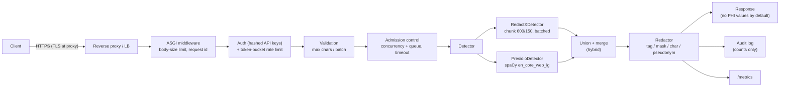

# RedactX in production

This guide covers deploying the RedactX redaction service: architecture, configuration, security model,
threshold calibration, monitoring, operations, and — most importantly — the evidence you need **before**
RedactX is allowed to touch real patient data.

> [!CAUTION]
> The production *code* is in place. Whether a given *model checkpoint* is fit for production is an empirical
> question that this code cannot answer for you. Complete the [readiness checklist](#readiness-checklist) on
> your own data first. Until the v2 checkpoint has been benchmarked, deploy in **hybrid** mode (RedactX ∪
> Presidio) or **presidio** mode, never RedactX alone.

---

## Contents

- [Architecture](#architecture)
- [Deployment modes](#deployment-modes)
- [Quick start](#quick-start)
- [Configuration](#configuration)
- [API](#api)
- [Security model](#security-model)
- [Threshold calibration](#threshold-calibration)
- [Benchmarking a checkpoint](#benchmarking-a-checkpoint)
- [Monitoring](#monitoring)
- [Batch redaction (CLI)](#batch-redaction-cli)
- [Docker](#docker)
- [Capacity planning and load testing](#capacity-planning-and-load-testing)
- [Runbook](#runbook)
- [Readiness checklist](#readiness-checklist)
- [Known limitations](#known-limitations)

---

## Architecture



| Component | Module | Notes |
|---|---|---|
| Long-document chunking | [`chunking.py`](../redactx/production/chunking.py) | Overlapping windows (default 600 chars, 150 overlap) cut at whitespace. Any identifier up to `overlap` chars long lies wholly inside at least one window (proof in the module docstring). Doc score = max over windows. |
| Detectors | [`detectors.py`](../redactx/production/detectors.py) | `RedactXDetector` (chunked, batched, one inference at a time per model), `PresidioDetector`, `HybridDetector` (character-level union). |
| HIPAA categories | [`hipaa.py`](../redactx/production/hipaa.py) | Maps RedactX, Presidio and dataset labels onto the 18 Safe Harbor identifier categories (+ non-HIPAA categories such as ORGANIZATION). |
| Redaction | [`redactor.py`](../redactx/production/redactor.py) | Strategies and the fail-closed policy for detected-but-unlocalized PHI. |
| Thresholds | [`thresholds.py`](../redactx/production/thresholds.py) | `redactx_thresholds.json` next to the checkpoint, written by `calibrate_thresholds.py`. |
| Settings | [`settings.py`](../redactx/production/settings.py) | `REDACTX_*` environment variables, validated at start-up. |
| Server | [`server.py`](../redactx/production/server.py) | FastAPI app factory `create_production_app`. |
| Metrics | [`metrics.py`](../redactx/production/metrics.py) | Dependency-free Prometheus text exposition. |

**Fail-closed everywhere.** If detection raises, the request fails with `503 detection_failed`; unredacted
text is never returned on an error path. If RedactX says a document contains PHI but cannot localize any span,
the `unlocalized_policy` decides (see below) — the text is never silently passed through.

---

## Deployment modes

| `REDACTX_MODE` | What runs | When to use |
|---|---|---|
| `hybrid` (default) | RedactX **and** Presidio; a character is redacted if either flags it | Recommended. Two detectors with different failure modes: recall ≥ either alone, at the cost of more over-redaction. |
| `presidio` | Presidio only | No validated RedactX checkpoint yet; lowest resource use (no GPU). |
| `redactx` | RedactX only | Only after the readiness checklist shows RedactX alone meets your recall targets. |

---

## Quick start

```powershell
python -m pip install -e ".[production]"
python -m spacy download en_core_web_lg

# 1. create an API key (prints the plaintext key once, and the hash for the server)
redactx hash-key

# 2. calibrate thresholds for the checkpoint (writes models/RedactX-v2/redactx_thresholds.json)
python calibrate_thresholds.py --model-dir ./models/RedactX-v2 --target-recall 0.98

# 3. configure and start
Copy-Item .env.example .env      # then edit REDACTX_MODEL_DIR and REDACTX_API_KEY_HASHES
redactx serve --host 127.0.0.1 --port 8080
```

```powershell
$h = @{ "X-API-Key" = "<plaintext key from step 1>" }
Invoke-RestMethod -Method Post -Uri http://127.0.0.1:8080/v2/redact -Headers $h `
  -ContentType "application/json" -Body '{"text": "Call Jennifer Okonkwo at 312-555-0198."}'
```

CLI flags override the environment for that process only: `redactx serve --mode presidio --strategy mask`.

---

## Configuration

All settings are `REDACTX_*` environment variables, optionally read from `.env` (the file is only read;
nothing is written to the user or system environment). Invalid values stop the server at start-up.
See [`.env.example`](../.env.example).

| Variable | Default | Meaning |
|---|---|---|
| `REDACTX_MODEL_DIR` | — | Exported checkpoint (must contain `config.json`). Required for `hybrid` / `redactx`. |
| `REDACTX_MODE` | `hybrid` | `hybrid` \| `redactx` \| `presidio` |
| `REDACTX_DEVICE` | auto | `cpu`, `cuda`, `cuda:0` |
| `REDACTX_STRATEGY` | `tag` | `tag` → `[NAME]`, `mask` → `[REDACTED]`, `char` → `****` (length-preserving), `pseudonym` → `[NAME_3f2a9c1b]` |
| `REDACTX_UNLOCALIZED_POLICY` | `redact_all` | `redact_all`: whole document → `[REDACTED_DOCUMENT]`. `review`: localized findings redacted, `action=REVIEW` for a human. |
| `REDACTX_HMAC_KEY` | — | Secret for `pseudonym` (≥ 16 bytes, or ≥ 32 hex chars). Rotating it changes every pseudonym. |
| `REDACTX_HIPAA_ONLY` | `0` | Redact only the 18 Safe Harbor identifier categories. |
| `REDACTX_RETURN_FINDING_TEXT` | `0` | Include original PHI values in findings. Leave off in production. |
| `REDACTX_PRESIDIO_SCORE` | `0.35` | Presidio minimum score. |
| `REDACTX_VALIDATORS` | `all` | Verified structured-ID validators inside the RedactX detector: `all`, `none`, or a list of `ssn,email,phone,mrn,npi`. They add or confirm spans (validator category wins), never remove them. |
| `REDACTX_MRN_CHECKSUM` | none | `luhn` or `mod11` if your facility's MRNs carry a check digit (rejects keyword-matched IDs that fail it). |
| `REDACTX_MRN_MIN_DIGITS` | `5` | Minimum digits for an ID after an MRN keyword. |
| `REDACTX_API_KEY_HASHES` | — | Comma-separated SHA-256 hex digests (`redactx hash-key`). |
| `REDACTX_ALLOW_NO_AUTH` | `0` | Disable auth (local development only; logs a warning). |
| `REDACTX_CORS_ORIGINS` | — | Explicit origins; `*` is rejected. |
| `REDACTX_MAX_CHARS` | `100000` | Max characters per document → `413 document_too_large`. |
| `REDACTX_MAX_BATCH` | `32` | Max documents per batch request → `413 batch_too_large`. |
| `REDACTX_MAX_BODY_BYTES` | `4000000` | Max request body, enforced while streaming (also for chunked uploads) → `413 payload_too_large`. |
| `REDACTX_RATE_LIMIT_PER_MIN` / `REDACTX_RATE_BURST` | `120` / `30` | Token bucket per API key (a batch costs one token per document) → `429` + `Retry-After`. |
| `REDACTX_REQUEST_TIMEOUT_S` | `60` | Per-request inference timeout → `504`. |
| `REDACTX_MAX_CONCURRENCY` / `REDACTX_MAX_QUEUE` | `1` / `16` | Concurrent inference jobs and how many more may wait → `503 overloaded`. |
| `REDACTX_CHUNK_CHARS` / `REDACTX_CHUNK_OVERLAP` | `600` / `150` | Window size and overlap for long documents. Keep `CHUNK_CHARS` equal to the training `--max-chars`. |
| `REDACTX_BATCH_SIZE` | `8` | Windows per forward pass. |
| `REDACTX_AUDIT_LOG` | `-` | `-` = stdout, or a file path. |

---

## API

All `/v2/*` endpoints and `/metrics` require `X-API-Key: <key>` or `Authorization: Bearer <key>`.

| Method | Path | Purpose |
|---|---|---|
| GET | `/healthz` | Liveness (process is up). No auth. |
| GET | `/readyz` | Readiness (model loaded and warmed up). No auth. `503` until ready. |
| GET | `/metrics` | Prometheus metrics. |
| GET | `/v2/info` | Mode, model fingerprint, thresholds and their provenance, limits. |
| POST | `/v2/detect` | `{"text": ...}` → findings and verdict, no redacted text. |
| POST | `/v2/redact` | `{"text": ..., "strategy": optional}` → redacted text + findings. |
| POST | `/v2/redact/batch` | `{"texts": [...], "strategy": optional}` → one result per document. |

Response of `/v2/redact` (shape):

```text
{
  "redacted_text":   string,
  "action":          "PASS" | "REDACTED" | "REDACTED_DOCUMENT" | "REVIEW",
  "contains_phi":    bool,
  "doc_score":       float | null,         # RedactX P(PHI), max over windows (null in presidio mode)
  "findings":        [ { "start", "end", "category", "hipaa_identifier", "score", "sources" } ],
  "category_counts": { category: count },
  "detectors":       [ "redactx", "presidio" ],
  "windows":         int,
  "latency_ms":      float,
  "model_version":   "hybrid:<12-hex fingerprint>"
}
```

Errors are JSON `{"error": <code>, "request_id": ...}` and never echo the submitted text:
`401 unauthorized`, `413 payload_too_large | document_too_large | batch_too_large`, `422 invalid_request |
invalid_strategy | pseudonym_not_configured`, `429 rate_limited`, `503 not_ready | overloaded | detection_failed`,
`504 timeout`. Every response carries `X-Request-ID` (yours if you send a valid one) and `Cache-Control: no-store`.

The previous, non-hardened gateway (`POST /v1/decision`) is still available as `redactx serve-legacy` for
development; do not expose it.

---

## Security model

| Threat | Control |
|---|---|
| Unauthenticated use | API keys required; the server refuses to start without keys unless `REDACTX_ALLOW_NO_AUTH=1`. Keys are stored only as SHA-256 hashes and compared in constant time against every configured hash. |
| Key leakage via logs | Only the first 8 hex chars of the key *hash* (`key_id`) appear in the audit log. |
| PHI in logs | Audit lines contain request id, key id, endpoint, status, document count, actions, category counts, latency and model version — never text or finding values. Validation errors are re-rendered without input. |
| PHI in responses | Finding values are omitted unless `REDACTX_RETURN_FINDING_TEXT=1`. |
| Abuse / DoS | Streaming body-size limit (incl. chunked uploads), per-document and per-batch limits, per-key token bucket, bounded concurrency + queue, timeouts. |
| Silent model swap | `/v2/info` and every response report a fingerprint of the deployed checkpoint files; a model directory without `config.json` is refused at start-up (the engine would otherwise fall back to another model). |
| Silent pass-through | Fail-closed on detector errors; `unlocalized_policy` for detected-but-unlocalized PHI. |
| Re-identification from pseudonyms | Keyed HMAC-SHA256; without the key, pseudonyms cannot be reversed or recomputed. Keep the key in a secret store. |
| Transport | Terminate TLS at a reverse proxy / ingress. The server itself speaks plain HTTP and should bind to localhost or a private network. |
| Browser access | CORS off by default; explicit origins only. |

Not in scope of this service: TLS termination, network policy, secret storage, data retention of the
upstream/downstream systems, and access review of who holds API keys.

---

## Threshold calibration

`0.5` is an arbitrary cut-off. For redaction, a miss is a leak, so thresholds are chosen for a **target recall**
on held-out data:

```powershell
python calibrate_thresholds.py --model-dir ./models/RedactX-v2 --target-recall 0.98
```

- **doc_threshold**: the largest P(PHI) threshold at which the one-sided **95% Wilson lower bound** on document
  recall still meets the target.
- **span_threshold**: the same idea for gold PHI spans, where a span counts as found if at least one of its
  tokens is above the threshold. Spans within one document are correlated, so this bound is somewhat
  optimistic.
- **Per source:** positives are grouped by source (ai4privacy, generator). Each group must meet the target on its
  own, and the final threshold is the minimum of the per-source thresholds.
  - The output records `binding_source` and, under `per_source`, each source's threshold, lower bound and recall
    at the chosen threshold.
- **Why:** the old point estimate (the largest threshold reaching the target *on the pooled sample*) overfits.
  - On v2 it chose 0.974, and held-out document recall came out at 0.80 (H) and 0.955 (P) instead of 0.98.
  - Stratified with the lower bound, ai4privacy binds at 0.521 (generator alone would allow 0.977).
- **Flags:**
  - `--confidence 0.9` loosens the bound.
  - `--point-estimate` restores the old behaviour.
  - If a source has too few positives to certify the target, the script warns (`target_certified: false`) and
    sets the threshold to flag every calibration positive of that source.
- Data: ai4privacy validation docs *after* the first 1000 (the benchmark uses the first 200) with their clean
  twins, PubMedQA `pqa_labeled` after the first 200, and generator notes with seed 4242. All disjoint from
  training and from `validate_model.py`.
- Output: `<model-dir>/redactx_thresholds.json`, including the operating point (recall, its lower bound,
  specificity, precision) and the provenance string, which `/v2/info` reports. The script warns when the target
  recall forces specificity below 0.5.
- Use `--dry-run` to inspect without writing; `--sources generator` works offline.

Calibration controls *sampling* error only. Held-out sets from a different distribution (e.g. the handwritten
set H) can still fall short. Always re-run `validate_model.py` afterwards, and calibrate on your own documents.

Re-run calibration whenever the checkpoint changes, and ideally on a sample of **your** documents.

---

## Benchmarking a checkpoint

```powershell
python validate_model.py --model-dir ./models/RedactX-v2
```

`train.py` runs this automatically after training. It prints three tables and writes
`validation_results.json`:

1. **Held-out benchmark** — document metrics (accuracy, recall, specificity, AUROC, Brier, ECE) on H / G / P / Q
   and exact-match span P/R/F1 vs. real Presidio, with the old v1 numbers for comparison.
2. **Deployment modes** — character-level precision / recall / F1 for RedactX, Presidio and the hybrid union on
   G, P and **L** (long documents of 5 concatenated ai4privacy docs, RedactX run through the production
   chunker), plus the recall RedactX would get on L without chunking.
3. **Per-category recall** — char-level recall per HIPAA category on P for each mode.

Character-level metrics ignore whitespace and are boundary-tolerant, which is what matters for redaction and is
the only fair way to score a union of detectors.

### n2c2 2014 (real clinical notes)

```powershell
python benchmark_n2c2.py --model-dir ./models/RedactX-v3 --n2c2-dir D:\data\n2c2-2014
python benchmark_n2c2.py --n2c2-dir D:\data\n2c2-2014 --skip-redactx    # Presidio + validators only, no GPU
```

- **Data.** The n2c2 2014 de-identification corpus needs a Data Use Agreement from the
  [DBMI Data Portal](https://portal.dbmi.hms.harvard.edu). Nothing is downloaded: unpack the release and point
  `--n2c2-dir` at it. The loader finds `training-PHI-Gold-Set1/2` and `testing-PHI-Gold-fixed` (or
  `testing-PHI-Gold`) anywhere below that folder.
- **Offsets.** Every tag's offsets are checked against its `text` attribute. A tag whose offsets are off is
  re-located near the stated position or dropped, and the counts are printed (`exact`, `relocated`, `dropped`).
- **Systems.** All are run live on the same notes:
  - `redactx`: the model alone.
  - `redactx+validators`: the production default.
  - `validators`: the validators alone.
  - `presidio`.
  - `hybrid`: `redactx+validators` ∪ Presidio.
- **Metrics:**
  - Character P/R/F1 against all n2c2 PHI.
  - **HIPAA recall**, restricted to Safe Harbor identifiers. Doctor names, hospitals, professions and states are
    n2c2 PHI but not Safe Harbor identifiers of the patient; ages count only when > 89.
  - Recall per HIPAA category and per n2c2 type (PATIENT, DOCTOR, MEDICALRECORD, ...).
  - Window recall and specificity: how often PHI-free 600-character windows of real notes are flagged.
- **Splits.** The default split is `test`. Calibration uses only `train` (below), so the two never overlap.
  Output goes to `<model-dir>/n2c2_results.json`.

### Calibrating on n2c2

```powershell
python calibrate_thresholds.py --model-dir ./models/RedactX-v3 --sources ai4privacy,pubmed,generator,n2c2 `
  --n2c2-dir D:\data\n2c2-2014 --n-n2c2 300
```

- **What gets added.** `n2c2` is its own calibration source, built from TRAIN-split notes cut into windows:
  - Positives: windows that contain gold PHI.
  - Negatives: their generic-replaced twins plus PHI-free windows.
- **Per-source rule.** Because calibration is per source, real clinical notes must meet the target recall on
  their own; an easier source cannot hide them.
- **Label policy.** n2c2 does not label gender, while the ai4privacy-trained model may. The PHI-free n2c2 windows
  therefore measure specificity under the n2c2 policy.

---

## Monitoring

`GET /metrics` (authenticated) exposes:

| Metric | Type | Labels |
|---|---|---|
| `redactx_requests_total` | counter | `endpoint`, `status` |
| `redactx_request_latency_seconds` | histogram | `endpoint` |
| `redactx_documents_total` | counter | `action` (PASS / REDACTED / REDACTED_DOCUMENT / REVIEW) |
| `redactx_findings_total` | counter | `category` |
| `redactx_rejected_total` | counter | `reason` (unauthorized, rate_limited, body_too_large, document_too_large, batch_too_large, overloaded) |
| `redactx_errors_total` | counter | `type` (timeout, exception class) |
| `redactx_inflight_requests` | gauge | — |
| `redactx_ready` | gauge | — |

Suggested alerts:

- `redactx_ready == 0` for > 5 min.
- Rate of `redactx_errors_total` > 0 (any `detection_failed` is worth a look).
- p95 of `redactx_request_latency_seconds` above your SLO.
- Sustained `redactx_rejected_total{reason="overloaded"}` → add replicas.
- **Drift:** a sudden change in the PASS / REDACTED ratio or in `redactx_findings_total` by category often
  means the input distribution changed (new document type, new template) — re-validate.
- A rising `REVIEW` / `REDACTED_DOCUMENT` share means RedactX flags documents it cannot localize.

---

## Batch redaction (CLI)

```powershell
# files, directories (*.txt, recursive) or '-' for stdin
redactx redact notes/ --out-dir redacted/ --report report.jsonl --mode hybrid --model-dir ./models/RedactX-v2
Get-Content note.txt | redactx redact - --mode presidio
```

- Writes `<name>.redacted.txt` per input into `--out-dir` (stdout for stdin).
- `--report` writes one JSON line per document with action, counts by category, offsets and scores — **no PHI
  values**.
- The CLI reads the same `REDACTX_*` settings; authentication settings do not apply to local CLI use.

---

## Docker

```powershell
docker build -t redactx:latest .
docker run --rm -p 8080:8000 `
  -v ${PWD}/models/RedactX-v2:/models/redactx:ro `
  --env-file .env `
  redactx:latest
```

- CPU image by default; for CUDA build with `--build-arg TORCH_INDEX=https://download.pytorch.org/whl/cu121`
  and run with `--gpus all -e REDACTX_DEVICE=cuda`.
- The model is mounted read-only, not baked in. The container runs offline (`HF_HUB_OFFLINE=1`).
- Runs as non-root (uid 10001); health check on `/healthz`; one model per container — scale with replicas.
- Inside the container, `REDACTX_MODEL_DIR` defaults to `/models/redactx`; don't override it with a host path
  from your `.env`.

> [!NOTE]
> The Dockerfile has not been built in the development environment used to write it (Docker was not
> available there). Build and smoke-test it (`/readyz`, one `/v2/redact` call) in your CI before relying on it.

---

## Capacity planning and load testing

Each replica holds one model and, with `REDACTX_MAX_CONCURRENCY=1`, runs one batch of windows at a time.
A document of *n* characters costs about ⌈(n − 150) / 450⌉ windows at the default chunking. Hybrid mode adds
Presidio's CPU time per document.

Measure your own hardware with real-sized documents:

```powershell
python loadtest.py --url http://127.0.0.1:8080 --api-key <key> --concurrency 8 --requests 400
python loadtest.py --url http://127.0.0.1:8080 --api-key <key> --endpoint /v2/redact/batch --batch 8 `
  --corpus notes.jsonl --field text --out loadtest.json
```

It reports requests/s, documents/s, p50/p95/p99 latency and the status mix (429/503/504 show where limits bite).

---

## Runbook

| Symptom | Likely cause | Action |
|---|---|---|
| Server exits at start with `Invalid RedactX settings` | Missing/invalid configuration | Read the listed errors; every one names the variable. |
| `/readyz` stays 503 | Model still loading / warm-up failed | Check logs; verify `REDACTX_MODEL_DIR` is a complete export and the device has memory. |
| Many `503 overloaded` | Load above capacity | Add replicas, or raise `REDACTX_MAX_QUEUE` if latency budget allows. |
| `504 timeout` | Very long documents or slow device | Lower `REDACTX_MAX_CHARS`, use a GPU, or raise `REDACTX_REQUEST_TIMEOUT_S`. |
| `503 detection_failed` | Exception inside a detector | Check the error log (exception class, request id). Nothing unredacted was returned. |
| Many `REDACTED_DOCUMENT` | RedactX flags but cannot localize | Inspect with `review` policy on a test instance; recalibrate `span_threshold`; consider retraining. |
| Over-redaction complaints | Thresholds tuned for high recall | Expected trade-off. Check the operating point in `/v2/info`; tune `--target-recall` with evidence. |
| Missed identifier reported | Model or Presidio gap | Record the category (not the value), add to the evaluation set, re-benchmark per category. |
| GPU OOM | Batch too large for the device | Lower `REDACTX_BATCH_SIZE` or `REDACTX_CHUNK_CHARS` (re-calibrate after changing chunking). |

Upgrading a model: export → `calibrate_thresholds.py` → `validate_model.py` → compare tables with the current
model → deploy to a canary → watch the action mix and error metrics → roll out. The `model_version` fingerprint
in responses and audit lines tells you which model produced each result.

---

## Readiness checklist

Production readiness is a property of **checkpoint + thresholds + your data**, not of the code. Before real PHI:

- [ ] **v2 checkpoint trained and benchmarked** with `validate_model.py`; tables saved with the release.
- [ ] **Clinical evaluation:** run on a de-identification corpus of real clinical notes (e.g. **n2c2 2014**, under
      its data use agreement) and on a sample of your own documents annotated by people. ai4privacy and the
      generator are *not* clinical notes.
- [ ] **Per-category recall** meets your policy for every HIPAA category present in your data (names, dates,
      MRNs/IDs, phone, address, …), in the mode you will deploy.
- [ ] **Thresholds calibrated** on held-out data for the target recall; operating point recorded.
- [ ] **Long documents:** L-set recall with chunking ≈ short-document recall.
- [ ] **Load test** on production hardware meets latency/throughput SLOs with realistic document sizes.
- [ ] **Security review:** keys in a secret store, TLS at the proxy, server on a private network, audit log
      shipped to tamper-evident storage, CORS reviewed.
- [ ] **Human review** process for `REVIEW` documents and a sampling QA process for `PASS` documents.
- [ ] **Rollback:** previous checkpoint and thresholds kept; deploys are canaried.
- [ ] **Legal/compliance sign-off** for your use case (HIPAA Safe Harbor vs. Expert Determination, BAAs).

---

## Known limitations

- **English only.**
- **Span categories from RedactX are heuristic**; Presidio supplies typed categories in hybrid mode.
- **Chunk boundary:** identifiers longer than `CHUNK_OVERLAP` characters (150 by default) may be split across
  windows; each part is still detected independently and merged, but context is reduced.
- **Thresholds transfer imperfectly** between document distributions; calibrate on data that looks like yours.
- **No DP guarantee** for the fine-tuned weights (VaultGemma's DP pre-training does not extend to fine-tuning).
- **In-process rate limiting** is per replica. Behind a load balancer with N replicas the effective limit is
  N × the configured limit; use a gateway-level limiter for strict global limits.
